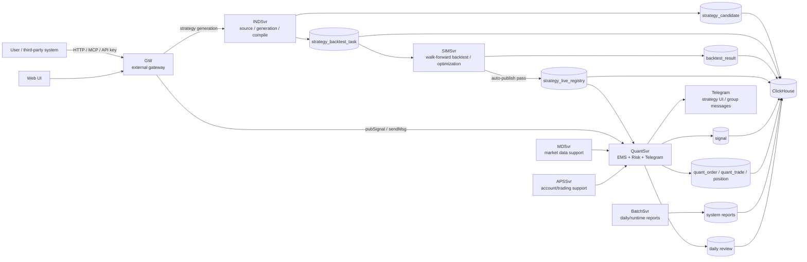

# dc-quant-deploy

Single-node Docker Compose deployment repository for DC Quant.

Chinese documentation: [README.md](README.md)

## What Is DC Quant

DC Quant is a quantitative strategy system that covers the full lifecycle:

```text
strategy source / generation -> backtest optimization -> auto publish -> live trading -> daily review -> system reports
```

## 5-Minute Architecture



Main services:

- `GW`: external HTTP/MCP/API-key entry point.
- `INDSvr`: strategy source ingestion, strategy generation, candidates, and compilation.
- `SIMSvr`: walk-forward backtesting, parameter optimization, and auto-publish decisions.
- `QuantSvr`: an EMS + Risk + Telegram runtime for live execution, risk parameters, order flow, notifications, and daily review.
- `BatchSvr`: daily reports, runtime reports, and batch jobs.
- `MDSvr/APSSvr`: market-data and account/trading support services.
- `Web`: web entry point.
- `ClickHouse`: storage for strategy, signal, order, trade, backtest, and report data.

## Quick Deploy

Minimum default requirements:

- Memory >= 8192 MB
- Free disk under `${DEPLOY_ROOT}` >= 20 GB

Deploy with bundled ClickHouse:

```bash
git clone https://github.com/bliplink/dc-quant-deploy.git
cd dc-quant-deploy
sudo ./prepare-host.sh
./deploy-standalone.sh
```

Deploy with an existing ClickHouse:

```bash
git clone https://github.com/bliplink/dc-quant-deploy.git
cd dc-quant-deploy
sudo ./prepare-host.sh
cp .env.external-clickhouse.example .env.prod
vi .env.prod
./deploy-with-external-clickhouse.sh
```

`prepare-host.sh` idempotently installs and verifies Docker Engine, Buildx,
Docker Compose v2, and Docker startup at boot. It supports
CentOS/RHEL/Rocky/AlmaLinux and Ubuntu/Debian.
For end-of-life EL7/CentOS 7, it pins the final repository releases:
Docker CE 26.1.4 and Compose 2.27.1, and automatically uses a CentOS 7.9.2009
archive repository plus an EL7 Docker CE mirror after the normal upstream
repositories have retired or become unreachable. Embedded ClickHouse uses the
configurable `CLICKHOUSE_IMAGE_REPOSITORY` mirror by default; environments with
direct Docker Hub access can set it to `clickhouse/clickhouse-server`. Run
`sudo ./prepare-host.sh --check` to
validate an existing runtime. To allow a
non-root user to run Docker, explicitly pass `--docker-user USER`; Docker group
membership grants root-equivalent access to the host.

On a fresh legacy EL7/XFS host where the kernel forces Docker to use the `vfs`
storage driver, host preparation automatically uses
`/opt/sumscope/docker-data` when `/opt/sumscope` is a separate mount. Override
it with `DOCKER_DATA_ROOT=/larger/path`. Existing Docker data and an existing
`/etc/docker/daemon.json` are never migrated or overwritten automatically.
Full-stack deployment requires at least 120 GB free in a `vfs` Docker data
root because that driver copies image layers instead of sharing them.

To deploy only selected services on a dedicated host, first configure external
ClickHouse, ZooKeeper, and `control.prod/dc.dat`, then run:

```bash
./deploy.sh --services apssvr,quantsvr
```

Selected-service deployment reuses the same configuration generation, backup,
and runtime checks as a full deployment, but uses `--no-deps`. It does not
start ZooKeeper, ClickHouse, or other application services on that host.

APSSvr does not require ClickHouse and defaults to fixed-address mode with
`RegisterEnable=0`, so an empty host can deploy it directly:

```bash
./deploy.sh --services apssvr
```

The repository includes a distributable trial `control.prod/dc.dat`. The script
prepares Docker, copies and validates the trial license, creates initial
configuration and mount directories, then starts only APSSvr. For production,
replace `control.prod/dc.dat` before deployment. If the bundled file is absent,
`--license-url HTTPS_URL` can download a license. Empty or placeholder licenses
are rejected before containers start so the service cannot enter a restart loop.
Selected-service deployment defaults to `MIN_SELECTED_MEMORY_MB=1024` and
`MIN_SELECTED_DISK_GB=5` instead of applying the full-stack 8 GB/20 GB gate.
Override these values in `.env.prod` for memory-intensive services. Control
sync keeps the host mount root and existing runtime `overrides` in place, and
selected deployment recreates only the selected containers so active bind
mounts cannot become detached.

For an empty-host smoke deployment that should start only required local
infrastructure without starting other application services, run:

```bash
./deploy.sh --services loginsvr --with-deps
```

This command prepares Docker when missing, creates initial `.env.prod` and
`control.prod` defaults, and starts only LoginSvr plus ClickHouse. LoginSvr
defaults to fixed-address mode with `RegisterEnable=0`, so ZooKeeper is not
started. ZooKeeper is included only when a selected service explicitly uses
`RegisterEnable=1`.

The deployment script automatically creates `${DEPLOY_ROOT}/control`,
`${DEPLOY_ROOT}/data`, `${DEPLOY_ROOT}/log`, and the per-service Java
preferences directories. `control` is mounted read-only, while `data`, `log`,
and Java preferences are made writable by `RUNTIME_UID:RUNTIME_GID`. Existing
application data ownership is not changed recursively.

Verify:

```bash
./validate.sh
docker compose --env-file .env.prod -f compose.yaml -f compose.override.generated.yaml ps
curl -I http://127.0.0.1/web/
curl 'http://127.0.0.1:8123/?query=SELECT%201'
```

## Post-Deployment Host Hardening

Host hardening is a separate operations step. It is not executed automatically by one-command deployment scripts. After the stack is deployed successfully, run:

```bash
sudo ./security/harden-host.sh
sudo ./security/validate-host-security.sh
```

To roll back host-level security rules:

```bash
sudo ./security/rollback-host-security.sh
```

The hardening script disables the host `nginx` service and keeps the `dc-web` container as the public web server. By default it allows only SSH, Web, GW, and the ClickHouse public proxy port. If production SSH does not use `22`, set `PUBLIC_SSH_PORT` in `.env.prod` first.

## Required Runtime Variables

The default one-command deployment can start the system skeleton. To enable Telegram and DeepSeek features, users must provide these values in `.env.prod`:

```bash
QUANTSVR_BOT_TOKEN=
QUANTSVR_BOT_USERNAME=
QUANTSVR_BOT_GROUP_ID=
QUANTSVR_BOT_ADMIN_LIST=
INDSVR_DEEPSEEK_API_KEY=
```

Notes:

- `QUANTSVR_ENABLE_BOT` can be left empty; when `QUANTSVR_BOT_TOKEN` is set, deployment scripts enable the Telegram bot automatically.
- To force-disable the Telegram bot, set `QUANTSVR_ENABLE_BOT=false` in `.env.prod`.
- Use `|` to separate multiple administrator IDs in `QUANTSVR_BOT_ADMIN_LIST`.
- The internal GW password does not need user configuration.
- Restart the affected service after changing `.env.prod`.

## After Deployment

Start from these Chinese guides:

- [Documentation hub](docs/README.zh-CN.md)
- [System overview](docs/02-architecture/system-overview.zh-CN.md)
- [Quick start after deployment](docs/01-getting-started/quick-start-after-deploy.zh-CN.md)
- [User guide](docs/03-user-guide/user-guide.zh-CN.md)
- [Core flows](docs/02-architecture/flows.zh-CN.md)
- [MCP API](docs/04-reference/mcp-api.zh-CN.md)
- [QuantSvr risk control and Telegram](docs/03-user-guide/quantsvr-risk-telegram.zh-CN.md)
- [Data model](docs/04-reference/data-model.zh-CN.md)
- [Reports and troubleshooting](docs/05-operations/reports-and-troubleshooting.zh-CN.md)
- [Latest branch auto deploy](docs/05-operations/latest-auto-deploy.zh-CN.md)
- [Security](docs/05-operations/security.zh-CN.md)

## Maintain

Restart one service:

```bash
./restart-service.sh quantsvr
```

Upgrade one service image:

```bash
vi .env.prod
docker compose --env-file .env.prod -f compose.yaml -f compose.override.generated.yaml pull quantsvr
./restart-service.sh quantsvr
```

View logs:

```bash
docker logs dc-quantsvr --tail 200
tail -n 100 ${DEPLOY_ROOT}/log/QuantSvr.log
```

Rollback after a failed full deployment:

```bash
./rollback.sh
```

## Security

Never commit `.env.prod`, real API keys, Telegram tokens, ClickHouse production passwords, or private runtime data.

QuantSvr and INDSvr bot/API credentials are maintained only in `.env.prod`. Users provide `QUANTSVR_BOT_TOKEN`, `QUANTSVR_BOT_USERNAME`, `QUANTSVR_BOT_GROUP_ID`, `QUANTSVR_BOT_ADMIN_LIST`, and `INDSVR_DEEPSEEK_API_KEY`. Deployment scripts generate `control/overrides/<Service>/config/application.properties` and mount it into the corresponding container. APSSvr does not require external API keys by default; exchange and BirdEye integrations are disabled unless explicitly customized. Restart the affected service after changing `.env.prod`.

See [SECURITY.md](SECURITY.md) for responsible security handling.

## License

Apache-2.0. See [LICENSE](LICENSE).
