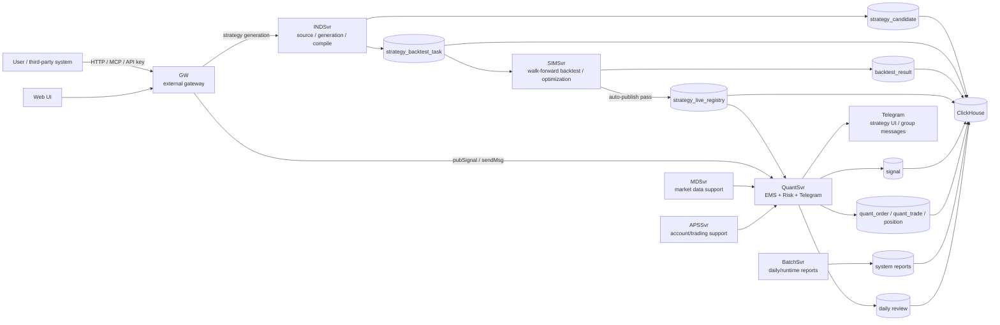

# dc-quant-deploy

Single-node Docker Compose deployment repository for DC Quant.

Chinese documentation: [README.md](README.md)

## What Is DC Quant

DC Quant is a quantitative strategy system that covers the full lifecycle:

```text
strategy source / generation -> backtest optimization -> auto publish -> live trading -> daily review -> system reports
```

## 5-Minute Architecture



Main services:

- `GW`: external HTTP/MCP/API-key entry point.
- `INDSvr`: strategy source ingestion, strategy generation, candidates, and compilation.
- `SIMSvr`: walk-forward backtesting, parameter optimization, and auto-publish decisions.
- `QuantSvr`: an EMS + Risk + Telegram runtime for live execution, risk parameters, order flow, notifications, and daily review.
- `BatchSvr`: daily reports, runtime reports, and batch jobs.
- `MDSvr/APSSvr`: market-data and account/trading support services.
- `Web`: web entry point.
- `ClickHouse`: storage for strategy, signal, order, trade, backtest, and report data.

## Quick Deploy

Minimum default requirements:

- CPU >= 2 cores
- Memory >= 8192 MB
- Free disk under `${DEPLOY_ROOT}` >= 20 GB

Deploy with bundled ClickHouse:

```bash
git clone https://github.com/bliplink/dc-quant-deploy.git
cd dc-quant-deploy
./deploy-standalone.sh
```

Deploy with an existing ClickHouse:

```bash
git clone https://github.com/bliplink/dc-quant-deploy.git
cd dc-quant-deploy
cp .env.external-clickhouse.example .env.prod
vi .env.prod
./deploy-with-external-clickhouse.sh
```

Verify:

```bash
./validate.sh
docker compose --env-file .env.prod -f compose.yaml -f compose.override.generated.yaml ps
curl -I http://127.0.0.1/web/
curl 'http://127.0.0.1:8123/?query=SELECT%201'
```

## After Deployment

Start from these Chinese guides:

- [Documentation hub](docs/README.zh-CN.md)
- [System overview](docs/02-architecture/system-overview.zh-CN.md)
- [Quick start after deployment](docs/01-getting-started/quick-start-after-deploy.zh-CN.md)
- [User guide](docs/03-user-guide/user-guide.zh-CN.md)
- [Core flows](docs/02-architecture/flows.zh-CN.md)
- [MCP API](docs/04-reference/mcp-api.zh-CN.md)
- [QuantSvr risk control and Telegram](docs/03-user-guide/quantsvr-risk-telegram.zh-CN.md)
- [Data model](docs/04-reference/data-model.zh-CN.md)
- [Reports and troubleshooting](docs/05-operations/reports-and-troubleshooting.zh-CN.md)
- [Security](docs/05-operations/security.zh-CN.md)

## Maintain

Restart one service:

```bash
./restart-service.sh quantsvr
```

Upgrade one service image:

```bash
vi .env.prod
docker compose --env-file .env.prod -f compose.yaml -f compose.override.generated.yaml pull quantsvr
./restart-service.sh quantsvr
```

View logs:

```bash
docker logs dc-quantsvr --tail 200
tail -n 100 ${DEPLOY_ROOT}/log/QuantSvr.log
```

Rollback after a failed full deployment:

```bash
./rollback.sh
```

## Security

Never commit `.env.prod`, real API keys, Telegram tokens, ClickHouse production passwords, or private runtime data.

See [SECURITY.md](SECURITY.md) for responsible security handling.

## License

Apache-2.0. See [LICENSE](LICENSE).
