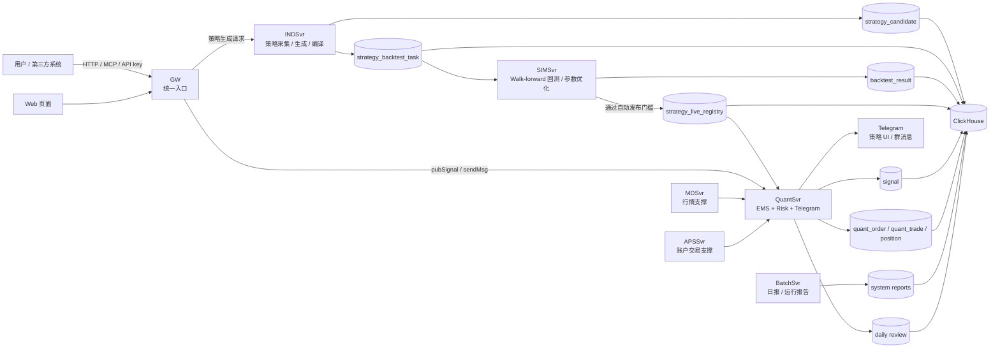

# dc-quant-deploy

DC Quant 是一套单机 Docker Compose 部署的量化策略系统，覆盖策略采集、策略生成、回测优化、自动上线、实盘运行、日末复盘、系统日报和运行报告。

English documentation: [README.en.md](README.en.md)

## 这是什么系统

系统由多个服务协作完成完整策略生命周期：

```text
策略采集/生成 -> 回测优化 -> 自动上线 -> 实盘运行 -> 日末复盘 -> 系统报告
```

## 5 分钟架构图



核心服务：

- `GW`：统一 HTTP/MCP/API key 入口。
- `INDSvr`：策略采集、策略生成、候选策略和编译。
- `SIMSvr`：walk-forward 回测、参数优化和自动发布。
- `QuantSvr`：类似 `EMS + Risk + Telegram` 的组合，负责实盘执行、风控参数、下单、通知和日末复盘。
- `BatchSvr`：系统日报、运行报告和批处理。
- `MDSvr/APSSvr`：行情与交易账户相关运行支撑。
- `Web`：页面入口。
- `ClickHouse`：策略、信号、订单、成交、回测和报告数据存储。

更完整的说明见：[系统总览](docs/02-architecture/system-overview.zh-CN.md)。

## 快速部署

机器默认要求：

- CPU >= 2 核
- 内存 >= 8192 MB
- `${DEPLOY_ROOT}` 可用磁盘 >= 20 GB

从空服务器部署，使用内置 ClickHouse：

```bash
git clone https://github.com/bliplink/dc-quant-deploy.git
cd dc-quant-deploy
./deploy-standalone.sh
```

使用已有 ClickHouse：

```bash
git clone https://github.com/bliplink/dc-quant-deploy.git
cd dc-quant-deploy
cp .env.external-clickhouse.example .env.prod
vi .env.prod
./deploy-with-external-clickhouse.sh
```

部署后验证：

```bash
./validate.sh
docker compose --env-file .env.prod -f compose.yaml -f compose.override.generated.yaml ps
curl -I http://127.0.0.1/web/
curl 'http://127.0.0.1:8123/?query=SELECT%201'
```

部署完成后的第一步见：[部署后快速开始](docs/01-getting-started/quick-start-after-deploy.zh-CN.md)。

## 部署后安全加固

安全加固是独立运维步骤，不会随一键部署自动执行。确认系统部署成功后，再执行：

```bash
sudo ./security/harden-host.sh
sudo ./security/validate-host-security.sh
```

如果需要回滚主机安全策略：

```bash
sudo ./security/rollback-host-security.sh
```

加固脚本会禁用宿主机 `nginx`，保留 `dc-web` 容器对外服务；默认只放行 SSH、Web、GW 和 ClickHouse 外部代理端口。生产如果 SSH 不是 `22`，先在 `.env.prod` 中设置 `PUBLIC_SSH_PORT`。

## 必填运行参数

默认一键部署可以先拉起系统骨架。要启用 Telegram 和 DeepSeek 能力，用户需要在 `.env.prod` 中自行提供：

```bash
QUANTSVR_BOT_TOKEN=
QUANTSVR_BOT_USERNAME=
QUANTSVR_BOT_GROUP_ID=
QUANTSVR_BOT_ADMIN_LIST=
INDSVR_DEEPSEEK_API_KEY=
```

说明：

- `QUANTSVR_ENABLE_BOT` 可留空；填写 `QUANTSVR_BOT_TOKEN` 后部署脚本会自动启用 Telegram bot。
- 如果要强制关闭 Telegram bot，可在 `.env.prod` 中设置 `QUANTSVR_ENABLE_BOT=false`。
- `QUANTSVR_BOT_ADMIN_LIST` 使用 `|` 分隔多个管理员 ID。
- GW 内部密码无需用户配置。
- 修改 `.env.prod` 后，需要重启对应服务。

## 部署后如何使用

主要入口：

- 使用 `GW` 的 MCP/API 入口提交外部信号或消息。
- 使用 `INDSvr` 创建或导入策略，生成 candidate。
- 使用 `SIMSvr` 自动执行回测、参数优化和上线判断。
- 使用 `QuantSvr` 运行已上线策略并生成日末复盘。
- 使用 `BatchSvr` 查看每日系统报告和 5 分钟运行报告。

完整使用说明见：[用户使用手册](docs/03-user-guide/user-guide.zh-CN.md)。

## 核心文档

- [文档中心](docs/README.zh-CN.md)
- [系统总览](docs/02-architecture/system-overview.zh-CN.md)
- [部署后快速开始](docs/01-getting-started/quick-start-after-deploy.zh-CN.md)
- [用户使用手册](docs/03-user-guide/user-guide.zh-CN.md)
- [核心流程](docs/02-architecture/flows.zh-CN.md)
- [MCP 接口](docs/04-reference/mcp-api.zh-CN.md)
- [QuantSvr 风控与 Telegram](docs/03-user-guide/quantsvr-risk-telegram.zh-CN.md)
- [核心数据表](docs/04-reference/data-model.zh-CN.md)
- [报告与排障](docs/05-operations/reports-and-troubleshooting.zh-CN.md)
- [安全说明](docs/05-operations/security.zh-CN.md)

## 常用运维

重启单个服务：

```bash
./restart-service.sh quantsvr
```

升级单个服务镜像：

```bash
vi .env.prod
docker compose --env-file .env.prod -f compose.yaml -f compose.override.generated.yaml pull quantsvr
./restart-service.sh quantsvr
```

查看日志：

```bash
docker logs dc-quantsvr --tail 200
tail -n 100 ${DEPLOY_ROOT}/log/QuantSvr.log
```

全量部署失败后回滚：

```bash
./rollback.sh
```

## 安全提醒

- 不要提交 `.env.prod`。
- 不要提交真实 API key、Telegram token、ClickHouse 生产密码。
- QuantSvr、INDSvr 的 bot/API key 只维护在 `.env.prod`，部署脚本会生成 `control/overrides/<Service>/config/application.properties` 并挂载到容器。
- 用户需要自行提供 `QUANTSVR_BOT_TOKEN`、`QUANTSVR_BOT_USERNAME`、`QUANTSVR_BOT_GROUP_ID`、`QUANTSVR_BOT_ADMIN_LIST`、`INDSVR_DEEPSEEK_API_KEY`。
- APSSvr 默认不需要外部 API key，相关交易所/BirdEye 开关默认关闭。
- 更新 `.env.prod` 后，重启对应服务让新配置生效。
- `control.prod.example/` 只放示例配置。
- 对外开放 MCP 前必须替换 `apiKeyList.csv` 中的示例 key。

许可证：Apache-2.0，详见 [LICENSE](LICENSE)。
