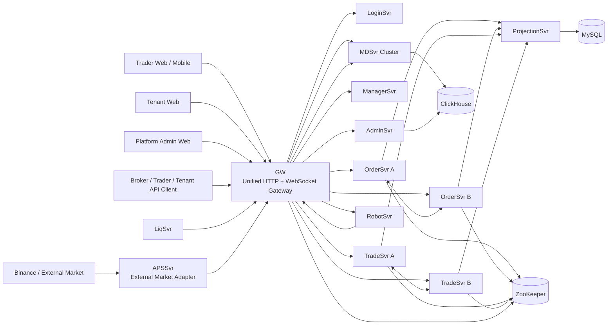

# DC Core Architecture 基线与后续会话交接说明

> **用途**：这是 `dc-quant-deploy` 的系统架构基线。任何新的 ChatGPT / Codex / WebCodex 会话，在继续开发、部署、验收、压测、排障之前，**必须先阅读本文件**。  
> **目标**：防止因为会话切换而误解服务职责、数据流、HA 模型、API 边界或当前阶段，导致重复开发、改错服务、错误重启、错误验收。  
> **当前主线**：`saas-crypto`  
> **最后更新**：2026-09-28

---

## 1. 系统最终目标

本系统不是单一交易页面，也不是单租户撮合 Demo，而是一套可对外提供服务的 **多租户交易核心平台**。

总体目标：

1. **多租户 SaaS 交易核心**
   - 平台可以创建和管理多个独立租户 / Broker。
   - 每个租户以 `location` 为核心隔离边界。
   - Broker 与 Broker 之间资金、账户、订单、持仓、行情配置、机器人配置彼此独立。
   - 支持两类 Broker：
     - 使用本平台 Web / location / 内置能力的 Broker；
     - 自建后端，通过 Broker API 接入本交易核心的 Broker。

2. **统一交易核心，可扩展多资产**
   - 当前第一阶段按 Crypto 完善。
   - 架构必须可继续扩展到 FX、商品、债券及自定义交易品种。
   - MarketIndicator / SecurityID / Location 等维度不能写死为加密货币专用逻辑。

3. **完整交易链路**
   - Login / Account
   - 下单 / 撤单 / 批量撤单
   - OrderSvr
   - TradeSvr
   - 撮合 / 风控 / 资金 / 持仓
   - Projection
   - Market Data
   - Robot liquidity
   - Kline / Trade history
   - Web / OpenAPI / WebSocket

4. **高可用核心**
   - 核心 HA 服务：**OrderSvr、TradeSvr、MDSvr、LiqSvr**。
   - 分区、主备、恢复、快照、journal、readiness、failover 必须以“业务不中断 / 数据不丢 / 可验证”为目标设计。
   - 不能把“容器活着”当作 HA 成功，必须验证 partition assignment、READY、replication、watermark、snapshot/journal 一致性。

5. **高性能**
   - 下单链路不允许人为 200ms 延迟。
   - Robot 盘口不允许明显延迟。
   - 首单冷启动需要消除。
   - 单热点盘口不能因为 1000 级压力就出现分钟级积压、假成功、不可查询或服务长期 PARTITION_NOT_READY。
   - 行情历史目标支持上亿 ticker / trade / kline 数据，并做到秒级查询。

6. **统一入口**
   - GW 是统一 HTTP + WebSocket 入口。
   - 外部客户端不应知道 OrderSvr / TradeSvr / MDSvr 的物理拓扑。
   - GW 做协议、路由、连接、聚合入口；**GW 不承载交易业务逻辑**。

---

## 2. 总体架构



---

## 3. 服务职责边界

### 3.1 GW

GW 是统一网关，不是业务服务。

职责：

- HTTP API 入口；
- WebSocket 长连接入口；
- 逻辑服务名到物理服务实例的路由；
- Order / Trade 分区路由；
- 服务预连接；
- 行情订阅 fanout；
- OpenAPI 的统一入口层。

禁止：

- 不把撮合、资金、持仓、强平、订单状态机等业务逻辑塞进 GW。
- 不让 Web 直接依赖 MDSvr / OrderSvr / TradeSvr 物理地址。

GW 配置必须提前声明核心 RequestService，使 GW 启动后可以预连接 A/B 实例，避免首单因为物理连接未 Online 触发多次退避。

---

### 3.2 OrderSvr

OrderSvr 是订单状态机和订单撮合入口。

主要职责：

- 接收 New / Cancel / CancelAll / Replace 等订单指令；
- 订单幂等；
- OrderID / ClOrdID 处理；
- 订单 book；
- 订单生命周期；
- 与 TradeSvr 进行风控 / 资金 / 持仓协作；
- 订单状态 journal；
- Order cluster partition / primary / replica / readiness / recovery。

重要原则：

- OrderSvr 的 HA 是 partition 级，而不是简单启动两个容器。
- 逻辑路由 key 必须和 OrderSvr 自己的 partition key 完全一致。
- 同一个 `location + market + symbol` 是一个热点 book，必须重点关注单热点吞吐。
- API `code=0` 的语义必须清晰，不能让“内存队列已接收”伪装成“订单已经 durable / 可查询”。

当前 OrderSvr 持久化使用 Chronicle Queue journal，并配合 snapshot、commit marker、replication、readiness guard 做恢复。

---

### 3.3 TradeSvr

TradeSvr 是账户、资金、持仓、风控和交易状态核心。

职责：

- 账户资产；
- cashIn / cashOut；
- Position；
- 保证金；
- 杠杆；
- 风险校验；
- 订单 Newing -> New 等风控确认；
- 成交后的资金 / 持仓变更；
- 强平相关账户计算；
- Trade partition HA。

原则：

- OrderSvr 与 TradeSvr 必须通过 location / partition 正确路由到当前 primary。
- TradeSvr client 必须预连接，不能依赖首单时临时建立物理连接。
- Web 上的账户 / 持仓 / 强平价展示不能反向污染 TradeSvr 职责。

当前强平设计方向：

- TradeSvr 负责持续计算账户 / 持仓风险；
- LiqSvr 负责强平执行策略；
- 前端可以组合展示 ADL 等级 / 强平信息，但不能把核心风险逻辑搬到前端。

---

### 3.4 ProjectionSvr

ProjectionSvr 是**交易核心状态的持久化投影层**。

必须牢记：

> **ProjectionSvr 同时消费 OrderSvr 和 TradeSvr 数据。**

它不是只接订单，也不是只接成交。

职责：

- 消费 Order journal / committed projection event；
- 消费 Trade mutation / projection event；
- 更新 MySQL durable projection；
- 维护 watermark；
- 为历史查询、审计、重启恢复验证提供落库状态。

已经建立的关键表包括：

- `dc_order_projection_watermark`
- `dc_order_projection_event`
- `dc_trade_projection_watermark`
- `dc_trade_projection_event`
- `dc_trade_projection_mutation`

修改 Projection 架构时，不能把 Order / Trade 任意一边漏掉。

---

### 3.5 MDSvr

MDSvr 负责实时行情生产与发布。

职责：

- 实时成交；
- order book / market data；
- Kline；
- 行情订阅；
- 通过 GW 对 Web / API 提供实时行情。

历史行情：

- Kline / market trade 等历史数据进入 ClickHouse；
- 历史查询由 AdminSvr 提供；
- Web 不应知道 MDSvr 实例拓扑。

当前明确方向：

> 实时订阅走 GW；历史查询走 AdminSvr + ClickHouse。

当前 Kline 不以 RocksDB 作为主历史查询方案。

---

### 3.6 RobotSvr

RobotSvr 是流动性机器人，不是普通 Demo bot。

核心目标：

- 提供 10+10 等多档盘口；
- 根据总金额在不同档位分配数量；
- stale quote 自动撤单；
- 用户挂到顶档时可以主动点掉；
- 用户与 Robot 成交后自动补单；
- 外部行情跟随 Binance；
- Kline 走势 / 成交量尽量和 Binance 一致，可按比例缩放；
- 后续支持外部对冲。

最重要的架构约束：

> **RobotSvr 只连接 GW。**

不要让 Robot 直接依赖 OrderSvr / MDSvr / TradeSvr 物理地址。

外部 Binance 数据链：

`Binance -> APSSvr -> GW -> RobotSvr / MDSvr`

---

### 3.7 APSSvr

APSSvr 是外部市场适配器。

当前 Crypto 阶段负责：

- Binance Futures WebSocket；
- bookTicker；
- aggTrade；
- depth；
- ticker；
- markPrice 等。

APSSvr 不做核心交易业务。

Mac / Colima 开发环境下，APSSvr 外部访问通过现有代理链。

**绝对不要随意修改 / 重启 Mac 的 v2rayN / xray。**

Mac 10808 必须视为只读基础设施。

---

### 3.8 LiqSvr

LiqSvr 负责 liquidation 执行。

职责方向：

- 接收需要强平的账户 / 持仓；
- 生成减仓 / 平仓指令；
- 强平 IOC；
- Insurance Fund / ADL 流程协调。

不要把 LiqSvr 和 TradeSvr 的职责混在一起：

- TradeSvr：账户风险计算、资金、持仓；
- LiqSvr：达到条件后的强平执行。

---

### 3.9 AdminSvr / ManagerSvr / LoginSvr

**LoginSvr**
- 登录、session、认证。

**AdminSvr**
- 平台 / 租户管理类聚合接口；
- 历史 Kline / market data 查询；
- OpenAPI 中适合聚合的非实时管理接口。

**ManagerSvr**
- 运行态管理；
- Robot runtime；
- 服务管理 / 监控类能力。

三者不能代替交易核心。

---

## 4. Web 与角色模型

系统有三套 Web：

1. **Platform Web**
   - 平台管理员；
   - 租户审批；
   - location 分配；
   - 集群 / 路由管理；
   - 系统级管理。

2. **Tenant Web**
   - 租户申请；
   - 租户登录；
   - 租户客户 / 交易账户管理；
   - 自己的 Broker / Trader 管理。

3. **Trade Web**
   - 核心交易页面；
   - 行情；
   - 下单；
   - Positions；
   - Account Info；
   - Open Orders；
   - TP/SL；
   - FOK / IOC；
   - Conditional / Trigger；
   - Cancel All；
   - 移动端交易体验。

UI 目标：

> 对标 Bybit 等成熟衍生品交易界面，但不复制其后端架构。

当前整体视觉已统一为蓝色主色 + 黑灰交易背景。

---

## 5. API 角色边界

系统对外 API 分三类。

### Broker API

Broker 可以：

- 创建客户交易账户；
- 客户充值 / 提现；
- 查询客户信息；
- 代客户下单 / 撤单；
- 查询订单 / 成交 / 持仓 / 资金。

适合自建 Broker 后端接入。

### Trader API

Trader：

- 使用自己的 API key；
- 只访问自己的账户；
- 下单 / 撤单；
- 查询自己的资金 / 持仓 / 订单 / 成交。

### Tenant API

租户可以：

- 创建交易账号；
- 用户管理；
- 资金操作；
- 下单 / 撤单；
- 查询；
- 基于平台交易核心开发自己的业务系统。

原则：

> Broker / Trader 的交易指令可以复用统一协议，但权限和可见数据范围不同。

统一 OpenAPI 由 GW 作为入口层，必要的聚合查询由 AdminSvr 提供。

---

## 6. 多租户与 location

`location` 是系统最重要的租户隔离键之一。

原则：

- 租户申请时用户不需要自己填写 location；
- 平台审批时生成唯一 location；
- location 可用于分配 Order / Trade / MD 集群；
- 默认走系统路由，平台后续可调整；
- 所有订单、资金、持仓、Robot、Projection、历史数据查询必须保持 location 隔离。

生产 location 规则必须规范化。

E2E 测试 location 同样要遵守正式规则，避免因为大小写 / 长度不同造成 GW 和服务端 partition hash 不一致。

---

## 7. 核心数据流

### 7.1 下单主链

```text
Trader/Web/API
  -> GW
  -> OrderSvr current primary
  -> Order journal / replica durability
  -> TradeSvr current primary
  -> risk/account/position
  -> OrderSvr state transition
  -> matching / trade
  -> ProjectionSvr
  -> MySQL
  -> MDSvr
  -> GW
  -> Web/API subscriber
```

任何优化不能破坏：

- ClOrdID 幂等；
- OrderID 唯一；
- journal durability；
- primary / replica fencing；
- Projection 一致性；
- Order / Trade watermark；
- location 隔离。

---

### 7.2 行情链

```text
Binance
  -> APSSvr
  -> GW
  -> MDSvr / RobotSvr
  -> ClickHouse (historical)
  -> GW realtime fanout
  -> Web / API
```

---

### 7.3 Robot 链

```text
Binance reference
  -> APSSvr
  -> GW
  -> RobotSvr
  -> GW
  -> OrderSvr
  -> TradeSvr
  -> fills
  -> Robot replenish / optional hedge
```

Robot 不直连核心物理节点。

---

## 8. HA / 分区原则

核心分区当前按 ZooKeeper assignment 管理。

必须区分：

- logical service：`OrderSvr` / `TradeSvr`
- physical node：`OrderSvrA` / `OrderSvrB`、`TradeSvrA` / `TradeSvrB`

GW 必须按 logical key 路由到当前 partition primary。

### OrderSvr

Order partition 目前包括：

- ZK assignment；
- primary / replica；
- epoch；
- READY；
- journal；
- snapshot；
- replication；
- promotion barrier；
- commit watermark；
- recovery。

节点重启后：

> 不能只看到 container running 就开始流量。

必须等：

- replication port online；
- partition recovery；
- READY；
- snapshot / journal / assignment 一致；
- verifier PASS。

### TradeSvr

Trade partition 同样必须验证：

- A/B role；
- partition READY；
- role reversal；
- watermark continuity；
- restart recovery；
- GW reconnect。

---

## 9. 数据存储职责

### MySQL

主要存：

- tenant；
- user；
- balance projection；
- order projection；
- trade projection；
- robot configuration；
- 管理数据。

MySQL 不是高频行情主存储。

### ClickHouse

主要存：

- Kline；
- market trade；
- 大规模行情历史；
- 秒级历史查询。

目标数据规模可以达到上亿级 ticker / trade。

### ZooKeeper

用于：

- cluster assignment；
- primary / replica；
- epoch；
- readiness / routing metadata。

### Chronicle Queue

当前主要用于 OrderSvr durable journal。

重点：

- Chronicle 是嵌入式 journal，不是独立微服务；
- journal 必须配合 snapshot / compaction / recovery；
- 不能让 journal 无限增长导致节点恢复时间不可接受。

---

## 10. 当前版本约束

非常重要，后续会话不要凭版本号猜依赖关系。

当前原则：

- **gateway-api 固定为 3.0.6**
- **com.app.common 与 gateway-api 是两套独立版本**
- OrderSvr 当前新构建链已经验证 `com.app.common=3.0.14`
- `3.0.14` 主要包含 Snowflake 时钟回拨保护
- 老镜像 / 其它服务可能仍带 `3.0.13`，修改前必须查看实际 image label / jar
- **绝对不要把 gateway-api 升成 3.0.14**

任何服务版本调整，先查 dependency tree，再编译测试。

---

## 11. 部署环境基线

开发 / E2E 主环境：

- Mac mini M4 / arm64 / 24GB；
- Colima arm64；
- Docker；
- 项目：`~/dc-quant-deploy`；
- 主分支：`saas-crypto`。

代理：

- Mac 本地代理端口：`10808`
- **禁止随意 kill / restart / edit v2rayN / xray**
- Mac 10808 视为只读；
- Colima 可以通过现有转发使用 10808。

Docker：

- Mac 侧 Docker socket 偶尔不可用时，可以 SSH 进入 Colima VM 使用 `docker`；
- 不要因为 CLI socket 问题就重启整个 Colima。

---

## 12. 部署与验收目标

最终必须沉淀成“一键完整流程”：

```text
卸载
  -> 全新安装
  -> 初始化数据库 / ClickHouse / ZK
  -> 初始化平台管理员
  -> 初始化 E2E 租户
  -> 初始化租户用户 / trader / broker
  -> 初始化默认 Robot
  -> 等待核心 partition READY
  -> validate-saas
  -> tenant lifecycle E2E
  -> broker API E2E
  -> projection consistency
  -> robot liquidity E2E
  -> trading-rule E2E
  -> non-destructive load test
  -> restart / role reversal / recovery test
  -> final report
```

### 默认 E2E 数据

应保留一组标准 E2E fixture，用于安装后自动验证。

当前长期 fixture 方向：

- location：`E2E001`
- robot：`default-depth10`

用户名 / 密码必须由部署环境变量初始化和输出，不要把真实生产密码硬编码到 Git。

安装脚本最后应该明确打印：

- Platform URL；
- Platform admin username；
- Platform admin password / password source；
- Tenant URL；
- E2E tenant location；
- Tenant username；
- Tenant password / password source；
- Trade URL；
- Robot runtime status。

---

## 13. 已经验证通过的关键能力

截至 2026-09-28，以下能力已经有真实 E2E / consistency 证据：

- `validate-saas.sh --env-file .env.prod` 基础部署检查；
- 21 个预期容器；
- GW Trade route；
- Tenant lifecycle；
- Broker API；
- Projection Order + Trade 双链；
- Projection watermark consistency；
- TradeSvr role reversal；
- Trade preconnection；
- MD -> ClickHouse；
- Robot Binance WS feed；
- Robot 10+10 liquidity；
- Robot IOC hit；
- Robot replenish；
- Robot Kline / reference price；
- Open Orders / FOK / IOC / Conditional / CancelAll 等交易规则；
- OrderSvr `common 3.0.14` 兼容测试；
- OrderSvr 新有界队列 / WAL-first 测试。

---

## 14. 当前性能基线与未解决问题

这一节是后续会话最容易偏离的地方。

### 14.1 不要误判“1000 单把系统打崩”

最近 1000 / concurrency=16 的单热点盘口压力没有让核心容器直接 crash：

- 0 restart；
- 0 OOM。

但是性能结果仍然不合格。

早期问题包括：

- Snowflake `Clock moved backwards`；
- 无界 NewOrder queue；
- queue backlog 1200+；
- MassCancel 60s timeout；
- API code=0 与 durable 状态不一致。

### 14.2 已经修掉的安全问题

OrderSvr `6a6ab72` 方向包含：

- `com.app.common=3.0.14` Snowflake rollback protection；
- bounded hot-book queue；
- `ORDER_BOOK_OVERLOADED` 明确背压；
- WAL-first admission；
- accepted request 必须最终 durable；
- pending new reconciliation。

最新 admission 1000/16 验证：

- 884 accepted；
- 116 明确 `ORDER_BOOK_OVERLOADED`；
- 884 / 884 最终 durable；
- 没有“ACK 成功但 durable 丢单”。

### 14.3 仍然未解决的性能瓶颈

单热点：

`A02AA7 + BTCUSDT`

当前真实 durable 吞吐约：

> **~16 orders/sec**

这远不是最终目标。

已确认架构热点：

1. 一个 `location + market + symbol` 对应一个单线程 NewOrderWorker；
2. 每批最多 64；
3. Order state 使用 STATE + COMMIT 两阶段 journal；
4. 主节点和副本都需要 journal append；
5. initial WAL 已经 batch；
6. TradeSvr 回包后的 `Newing -> New` 仍存在逐单 durable 路径，需要继续优化；
7. callback `AsyncSeqThreadGroup` 按 userId hash，同一用户回调会落固定 lane；
8. 当前 CPU 配额较低：
   - Order A/B 约 1.5 CPU / node；
   - Trade A/B 约 0.5 CPU / node；
   - GW 约 0.35 CPU。

Chronicle Queue 单独微基准达到数万到数十万 writeText/sec，因此 **Chronicle 库本身不是 16 orders/sec 的根因**。

### 14.4 OrderSvr 节点恢复问题

当前还发现一个重要问题：

OrderSvr 节点重建 / restart 时，部分 partition 可能长期：

`PARTITION_NOT_READY`

并出现：

`EPOCH_NOT_ADVANCED`

即：

- ZK candidate epoch 和本地 recovered source epoch 相同；
- same-epoch restart 安全恢复逻辑需要继续验证；
- lifecycle 当前使用**单线程**遍历和同步恢复 partition；
- 不应通过反复 restart 掩盖。

当前 journal / snapshot 体量也需要治理：

- OrderSvrB journal 约 1.4GB；
- snapshot 总量约 13MB；
- P089 journal 约 138MB；
- snapshot 约 6.4MB。

后续必须继续验证：

- same-epoch restart；
- snapshot boundary；
- journal compaction / rebase；
- restart RTO；
- 是否需要并行 partition recovery。

---

## 15. 压测方法原则

压测不能只看 HTTP success。

必须同时看：

- HTTP accepted；
- `ORDER_BOOK_OVERLOADED`；
- durable `dc_orders` count；
- Rejected；
- Newing -> New 收敛；
- execorders；
- posting；
- position；
- Projection watermark；
- queue depth；
- CPU；
- memory；
- OOM；
- restart count；
- replication timeout；
- p50 / p95 / p99；
- overload 后恢复时间。

尤其：

> `code=0` 的语义必须和最终 durable 结果一起验证。

单热点压测和多 symbol / 多 location 压测要分开。

---

## 16. Web / Trading 产品方向

Trade Web 对标专业衍生品交易体验。

关键要求：

- 下单区域首屏可见；
- TradingView 深色背景；
- Positions / Account Info 对齐；
- Open Orders 稳定；
- Kline 初始失败不能让整个交易终端失效；
- 15s timeout 后按钮恢复；
- ReduceOnly / Market Close / TP/SL 使用标准 CLOSE；
- FOK；
- IOC；
- Conditional Limit；
- TriggerLimit；
- 精度边界；
- CancelAll 部分失败；
- 500 Open Orders 内部限制，DOM 渲染限制；
- Desktop / Mobile 都要真实页面验收。

不要为了后端排障随意改动 Web 已经稳定的交互。

---

## 17. 开发与操作纪律

后续会话必须遵守：

1. **先读本文件，再开始任务。**
2. 先确认当前目标，不要从 Projection 跳回 Order、从 Robot 跳到无关服务。
3. 验证过程中不要没事重建服务。
4. 只重启需要重启的单个服务。
5. HA 服务必须按 A -> READY -> B -> READY 滚动。
6. 每次修改前先 `git status` / diff。
7. 不要把已有未提交改动一起误 commit。
8. 不要覆盖其它并行 worktree 的代码。
9. Git push 可通过本机 10808，但**不能修改代理本身**。
10. 用户要求短步骤推进，长任务按 30~60 秒粒度持续报告进度。
11. 任何“PASS”必须有真实 E2E / consistency / runtime 证据。
12. 不能把 mock / 效果图当真实页面验收。
13. 不能把容器 running 当 cluster READY。
14. 不要为了解决测试脚本问题去改生产业务逻辑，先区分测试缺陷还是系统缺陷。

---

## 18. 后续优先级

当前正确推进顺序：

### P0 — OrderSvr 性能与恢复

- 修复 / 验证 same-epoch restart；
- 保证重建节点可以重新 READY；
- 降低 hot-book 单线程链路延迟；
- 批量化 Trade callback durability；
- 保持 WAL-first / bounded queue；
- 压测至少做到过载可控、无假成功、无丢单；
- 完成单热点 / 多热点两类 benchmark。

### P1 — 完整卸载 / 安装 / 初始化 / 自动 E2E

沉淀一整套脚本：

- uninstall；
- install；
- config generation；
- platform admin seed；
- E2E tenant seed；
- trader / broker seed；
- default robot seed；
- credentials summary；
- full acceptance。

### P2 — 最终 HA / fault acceptance

- Order A/B restart；
- Trade A/B role reversal；
- MD HA；
- Liq HA；
- GW reconnect；
- snapshot/journal recovery；
- Projection continuity。

### P3 — Web E2E runner

Playwright runner 之前有依赖 / 网络问题。

这属于测试基础设施问题，不等于交易系统失败。

---

## 19. 新会话开始时应该先做什么

新的会话继续本项目时，先执行：

```bash
cd ~/dc-quant-deploy
git branch --show-current
git status --short
git log -5 --oneline
```

然后阅读：

```text
docs/DC_CORE_ARCHITECTURE_BASELINE.zh-CN.md
```

再读取当前正在处理服务的代码 / commit / runtime 状态。

如果当前任务是部署 / 验收，再检查：

```bash
./validate-saas.sh --env-file .env.prod
```

如果当前任务是 Order HA / 性能，则先检查：

- Order A/B ImageID / revision；
- common version；
- ZK partition assignment；
- READY；
- 19121 / 19122；
- verifier；
- 当前是否有遗留 stress 进程；
- 当前 E2E tenant 是否有活动订单。

---

## 20. 一句话架构原则

> **这是一个以 location 隔离的多租户交易核心：GW 统一入口，Order 管订单与撮合入口，Trade 管账户资金持仓与风控，Projection 同时落 Order/Trade，MD 负责实时行情，ClickHouse 负责大规模历史行情，Robot 只通过 GW 提供流动性，核心服务按 partition 做 HA；任何优化都不能破坏 durable、幂等、隔离、路由和恢复语义。**
