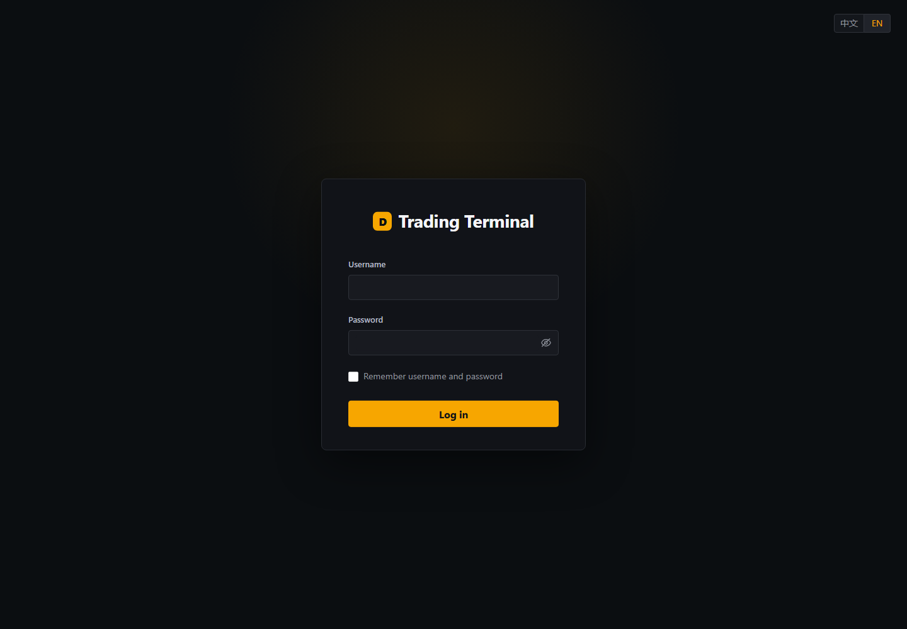

# DC SaaS 加密货币永续合约系统产品与验收说明

文档版本：V1.1

基线日期：2026-08-30

代码分支：`saas-crypto`

历史核心验收环境：`172.16.97.64`，`location=CORE_E2E`；下一统一部署环境：`172.16.97.105`

## 1. 文档目的与结论

本系统是从既有 DC 通用交易能力中独立演进的 SaaS 加密货币交易系统。它与量化系统的 `latest` 分支相互独立；SaaS 分支不保留量化业务，只复用 GW、公共包、服务发现、订单、交易、行情等成熟基础设施。

截至本基线，单租户单交易对的永续合约核心闭环已经形成并通过自动化验收：登录、测试入金、限价/市价下单、撤单、撮合、行情、订单与成交查询、资金与持仓、手续费、杠杆和风险档位、资金费、只减仓、止盈止损/OCO、部分强平、最终强平、保险基金和事务型 ADL。

本轮在 64 环境完成 17,100 个压力订单请求、11,400 条双方执行记录和 11,400 条成交资金流水的精确核对；峰值档为 3,000 个挂单、3,000 个 maker 单、3,000 个 taker 单，32 并发，全部成功。五个核心服务共 140 项单元测试全部通过，完整主机验收退出码为 0。

当前结论是“核心交易功能可供产品验收和继续开发”，不是“可直接承载真实用户资金”。真实资金上线前仍必须完成服务端权威租户、不可变复式账本/持久化事件、生产指数和标记价、私有流、限流、安全合规、高可用、灾备和更高容量门禁。

## 2. 产品定位与范围

### 2.1 当前产品形态

- 产品类型：USDT 本位加密货币永续合约交易系统。
- 使用方式：Web 交易端经 GW 调用后端服务；业务服务仍可供 API/策略调用。
- 租户标识：当前以 `location` 区分租户。
- 事务数据库：MySQL。
- 行情/K 线数据库：ClickHouse。
- 服务发现：ZooKeeper。
- 部署方式：公开容器镜像、Docker Compose 一键部署/卸载、定时自动更新和失败回滚。
- 当前验收品种：`BTCUSDT`，市场标识 `4`。

### 2.2 当前不包含的范围

- 真实链上充值、提现、归集和冷热钱包；页面 Deposit 仅为测试记账。
- KYC/KYB、AML、制裁筛查、Travel Rule 和司法辖区合规。
- 生产级多活、多可用区和撮合热备。
- 完整 Binance/Bybit 协议兼容层与官方 SDK 兼容承诺。
- 已产品化的租户申请、审批、独立域名、租户管理员和 RBAC 控制台。
- RobotSvr 的正式 SaaS 部署；RobotSvr 架构已规划，但不在当前 64 环境 13 个核心容器内。

## 3. 用户入口与当前账号

- 下一验收 Web 地址：`http://172.16.97.105:18088/#/login?location=CORE_E2E`（部署完成后启用）
- 用户：`corebuyer` 或 `coreseller`
- 密码：`WebE2E!20260827`
- 页面使用 HTTP，浏览器显示“不安全”是测试环境预期；生产必须启用 HTTPS、HSTS 和可信域名证书。

### 3.1 专业交易工作区

交易端采用专业 USDT 永续合约工作区，保留本系统现有业务字段和服务接口：

- K 线图、订单簿/最近成交、下单、持仓/委托/成交和账户资产共五类面板。
- 桌面端支持拖动、缩放和自动重排；可以锁定布局防止交易时误操作，也可以一键恢复默认布局。
- 布局按 `location + user_id` 保存在浏览器本地，刷新后恢复，不同租户和用户互不共享。
- 支持中文和英文切换；行情、下单、表头、方向、订单类型和状态随语言变化，协议标识保持原值。
- 顶部行情条突出展示最新成交价，并按涨跌方向着色；下单区在请求发出前校验数量、限价和触发价必须为正数。
- 市场抽屉支持中英文搜索和空结果提示；选择品种时直接使用服务数据中的交易对代码，不依赖 DOM 文本反解析。
- 切换品种和离开交易页时统一释放订单、成交、持仓、资金、订单簿和行情 WebSocket 订阅，防止重复回报与无效取消订阅异常。
- 使用深色层级、专业买卖色、紧凑表格和响应式断点，功能布局参考主流永续合约交易终端，但不复制其品牌和专有素材。

Web 源码提交为 `d65a0761e0f7c6d8efc7a2153f1cdbb4bf247d41`，公开镜像为 `ghcr.io/bliplink/dc-saas-trade-web@sha256:26eb5ec02f619398bc72da0562bdef5920f5a15de8b8a65c0f4fbdd3c7954c47`。生产构建、公开镜像构建和匿名拉取验证已通过；本地生产构建截图已归档。下一步在 105 环境完成新界面部署、浏览器自动化和远端截图，不能用本地截图替代远端验收结论。

## 4. 总体架构与服务职责

```text
Web / API / RobotSvr(规划)
          |
          v
        GW ---- LoginSvr（登录、会话）
          |
          +---- OrderSvr（规则校验、幂等、订单簿、撮合、条件单）
          |          |                  |
          |          | execution        +---- MDSvr（租户订单簿/逐笔/K线）
          |          v                               |
          +---- TradeSvr（余额、持仓、保证金、费用、资金费、保险、ADL）
          |          ^                               v
          |          | position/mark               ClickHouse
          +---- LiqSvr（强平监控、部分/最终强平）
          |
          +---- APSSvr（指数行情中心；外部行情 -> 指数/标记价输入）
          |
          +---- AdminSvr（面向 Web 的管理接口）
          +---- ManagerSvr（后台运营管理）

Order/Trade/Login/Admin/Manager/Liq 事务与配置 -> MySQL
全部服务发现与路由 -> ZooKeeper
```

| 服务 | 当前职责 | 关键租户边界 |
|---|---|---|
| GW | HTTP/WebSocket 入口、服务路由、Topic 转发 | 当前保持通用网关；不在本阶段强改。服务 snapshot 校验订阅，校验失败不返回订阅确认，GW 不把 Topic 加入订阅表 |
| LoginSvr | 用户登录和认证 | 用户凭据与 location 绑定；错误 location 登录已验收拒绝 |
| OrderSvr | 参数、品种和订单规则；幂等；改单/撤单；价格时间优先撮合；条件单 | 订单簿、锁、幂等和撮合序列包含 location、market、symbol |
| TradeSvr | 账户余额、冻结、持仓、保证金、手续费、资金费、保险基金、ADL | 余额/持仓/流水/ADL 查询和写入包含 location |
| LiqSvr | 消费租户标记价格与持仓，触发部分或最终强平 | 标记价 key、重试 key、强平订单均包含 location |
| MDSvr | 每个租户独立订单簿行情、最近成交和 K 线 | 行情不是全租户共享；按 location 发布和持久化 |
| APSSvr | 外部行情接入、指数计算输入、向 GW/MDSvr 提供指数类行情 | 未来需按租户的指数方案和配置生成数据 |
| AdminSvr | 向 Web 提供管理类接口 | 未来承载租户管理员前台接口 |
| ManagerSvr | 后台运营管理 | 未来承载平台审批、租户配置和审计 |
| RobotSvr | 规划中的租户策略/流动性服务：使用租户 API key 报单，订阅 APSSvr，按 ticker 报价档位并做外部反向对冲 | 必须按租户、API key、品种和策略实例隔离；当前未部署验收 |

## 5. 核心交易业务规则

### 5.1 订单身份与生命周期

- 租户内订单身份由 `location + user_id + ClOrdID` 约束。
- 相同 ClOrdID、相同订单指纹的重试返回既有结果，不重复下单。
- 相同 ClOrdID 但价格、数量、方向、订单类型、只减仓或触发参数不同，按幂等冲突拒绝。
- 状态覆盖 `Newing`、`New`、`Partially_Filled`、`Filled`、`Pending_Cancel`、`Cancelled`、`Rejected`、`Expired`、`Untriggered`、`Triggered`。
- 同一 `location + orderId` 的订单生命周期事件串行处理。订单已进入终态后，迟到的 Newing 不得重新冻结资金。
- OrderSvr 访问 TradeSvr 超时时按“不确定结果”重试，不伪造 Rejected；压力测试会把任何异步 Rejected 视为失败。

### 5.2 品种过滤器

每个交易品种从配置读取并校验：

- 交易开关和过期状态。
- `tick_size`：限价必须为价格步长整数倍。
- `qty_tick_size`：数量必须为数量步长整数倍。
- `min_order_qty`、`max_order_qty`。
- `min_notional`：限价名义金额 `price × quantity` 不得低于门槛。
- `max_price`。
- `market_take_bound`：市价单从最优对手价计算保护限价，买单向上、卖单向下限制最大吃单范围，并按 tick 对齐。

当前 BTCUSDT 验收配置使用 0.1 价格步长、0.0001 数量步长、0.0001 最小数量、10 最大数量、5 USDT 最小名义金额、5% 市价保护边界和 1,000,000 最大价格。

### 5.3 订单类型与 TIF

| 能力 | 当前规则 |
|---|---|
| Limit + GTC | 未成交数量按价格时间优先进入订单簿 |
| Limit + IOC | 立即成交可成交数量，剩余数量取消，不挂入订单簿 |
| Limit + FOK | 下单前预检全部可成交数量；不能全部成交则整单不成交 |
| Post Only / PO | 只允许 Limit；若立即成为 taker 则拒绝/取消，保证 maker 语义 |
| Market | 必须使用 IOC；订单簿为空时取消；使用最优对手价与 market_take_bound 生成保护限价 |
| 条件限价/市价 | 支持 Trigger、Stop、StopMarket、TakeProfit、TakeProfitMarket 等触发入口 |

### 5.4 撮合规则

- 每个 `location + marketIndicator + securityID` 是独立订单簿。
- 买方最高价优先、卖方最低价优先；同价按进入撮合序列的时间优先。
- 每个订单簿所有被接受的新订单进入单写撮合序列，避免并发下出现残留交叉盘口。
- 成交价采用簿内 maker 价格；双方分别生成执行记录，明确 maker/taker 标记和费率。
- GTC 未成交余量可挂单；IOC/FOK/Market 不保留余量。
- 撮合后的订单簿必须满足最高买价小于最低卖价；压力测试对此做硬断言。

### 5.5 自成交保护（STP/SMP）

- 自成交身份至少要求相同 location 和相同用户；跨租户或不同用户不视为自成交。
- 已实现 `CANCEL_TAKER`、`CANCEL_MAKER`、`CANCEL_BOTH` 三种模式解析和撮合行为。
- 未传或传入非法模式时 fail-safe 为 `CANCEL_TAKER`。
- 当前主机级严格验收覆盖默认 Cancel Taker；SMP group、租户级组合规则和三模式完整接口验收仍属于后续产品化门禁。

### 5.6 撤单、改单和批量操作

- 普通撤单必须匹配 location、用户和订单身份。
- Replace 为原子取消并重建；关键身份、方向和只减仓语义必须一致，失败不能留下半完成状态。
- Batch Cancel 只能取消当前 location 和当前用户的指定订单。
- Mass Cancel 按用户、location、市场/品种边界清理活动单。
- 撤单或终态后冻结保证金和冻结手续费不得小于 0，最终必须完全释放。

### 5.7 只减仓、平仓与保护订单

- `reduceOnly=true` 只能用于 `OCType=ClOSE`；开仓单设置 reduceOnly 直接拒绝。
- reduceOnly 单不得同时新建 TP/SL，避免平仓订单再次派生保护单。
- 平仓数量不能超过对应方向可用持仓；成交后不得反向开仓。
- Web Close 生成反向 Market/IOC/ReduceOnly 平仓单。
- 开仓订单可附带 StopLossPrice 和 TakeProfitPrice；保护单继承 location、用户、品种和原始引用，触发后仍为 reduce-only Close。
- 同一父单的止盈/止损构成 OCO；一侧触发后取消另一侧。
- 追踪止损枚举已存在，但未完成生产级回调率、激活价和接口验收，因此不作为当前已交付能力。

## 6. 资金、持仓与风险规则

### 6.1 账户字段

- `balance`：已结算账户余额。
- `used_margin`：持仓占用保证金。
- `freezed_margin`：活动开仓委托冻结保证金。
- `freezed_commission`：活动委托冻结手续费。
- 持仓按 long/short 分别记录数量、均价、占用保证金、锁定数量和强平价。

### 6.2 杠杆与风险档位

- 用户可按 `location + user + symbol` 配置杠杆，当前允许范围 1–100。
- 风险档位按名义价值递增配置 notional floor/cap、维持保证金率、维持保证金扣减额和最大杠杆。
- 更高档位的维持保证金率不得下降，最大杠杆不得上升。
- 新开仓使用 `max(markPrice, orderPrice) × projectedQuantity` 检查名义价值和档位最大杠杆。
- 超过最后一个风险档位上限或杠杆超过当前档位上限时拒绝。

### 6.3 保证金和手续费

- 初始保证金基础值：`positionNotional / leverage`。
- 多仓破产价：`entryPrice × (leverage - 1) / leverage`。
- 空仓破产价：`entryPrice × (leverage + 1) / leverage`。
- 为防止开仓后无法承担平仓费，剩余整个持仓按破产价预留 taker 平仓手续费；maker 开仓优惠不得降低该保守预留。
- 实际成交手续费：`lastQty × lastPx × makerOrTakerRate`，扣款以负资金流水记录。
- 部分平仓按成交数量计算已实现盈亏，按剩余持仓重算均价、保证金和保守平仓费预留。
- 单向翻仓时先完整关闭原方向，再按剩余数量建立新方向；手续费始终按实际 maker/taker 方向扣减，不得倒记为收入。

### 6.4 资金流水持久化

- 成交、入金、资金费、ADL 实现盈亏和 ADL 分摊均生成带 location、用户、品种、来源、来源 ID 和时间的资金流水。
- 普通成交流水在 TradeSvr 请求线程外批量写 MySQL；单批最多 250 条，失败整批原样重试。
- Docker 优雅停止时等待流水队列排空；本轮 3,000/32 压力下 6,000 条成交流水在重启前精确落库。
- 当前队列仍是进程内队列，不是持久化 outbox。宿主机断电、SIGKILL 或长时间 MySQL 不可用仍可能导致未落库数据丢失；真实资金前必须改为事务 outbox/不可变账本。

### 6.5 资金费

- 结算周期必须为 1–24 小时的整小时数。
- 每个品种按调度时间扫描全部 location 的持仓，并从对应租户标记价和资金费率计算。
- 净持仓：`longPosition - shortPosition`。
- 余额变化：`-netPosition × markPrice × fundingRate`，保留 8 位小数。
- `(location,user,symbol,settlementTime)` 使用唯一结算记录；重复调度、重放或重启不得重复扣款。
- 结算记录、余额、持仓保证金调整和资金流水在同一 MySQL 事务内完成。

## 7. 强平、保险基金与 ADL

### 7.1 强平触发

- LiqSvr 消费按 location 发布的标记价格和 TradeSvr 持仓。
- 多仓：`markPrice <= longLiqPrice` 触发。
- 空仓：`markPrice >= shortLiqPrice` 触发。
- 重试 key 包含 location、用户、品种和方向；默认重试窗口内禁止重复发起。
- 发强平单前先尝试取消该用户活动单并释放冻结资产。

### 7.2 部分与最终强平

- 默认部分强平比例 25%，数量向上/向下按品种 step 对齐，并保证剩余仓位仍能满足最小数量。
- 无法形成合法部分数量时直接最终强平。
- 强平订单固定为反向 `ClOSE + ReduceOnly + Market + IOC`。
- 部分强平标记 `close_by=liq_partial`；最终强平标记 `close_by=liq`。
- 只有实际撮合成交后，TradeSvr 才更新余额、持仓和亏空；不会仅凭“已发强平请求”宣称完成。

### 7.3 保险基金

- 最终强平后的负余额/穿仓差额首先由 `location + securityID` 的保险基金覆盖。
- 保险覆盖额不超过基金可用余额。
- 亏空、已覆盖、未覆盖、ADL 已覆盖和剩余金额写入 `dc_liquidation_deficit`。

### 7.4 ADL 候选与排序

- 只在相同 location、相同品种中选择与被强平方向相反的盈利持仓。
- 多头盈利单价：`referencePrice - averagePrice`；空头盈利单价：`averagePrice - referencePrice`；非盈利候选排除。
- 盈利率：`unrealizedProfit / usedMargin`。
- 有效杠杆：`positionNotional / (accountBalance + unrealizedProfit)`。
- 排名分数：`profitRate × effectiveLeverage`，按分数、盈利率、有效杠杆降序，再按 userID 稳定排序。
- 按排名依次减仓；减仓数量按品种 step 对齐，不超过候选可用持仓。
- 单候选事务同时更新候选持仓、持仓保证金、账户余额、`ADL_REALIZED`、`ADL_ALLOCATION` 和 ADL ledger。
- 全部候选、保险基金、被强平账户、亏空事件和 ADL 状态在一个 MySQL 事务内提交；并发变化导致受影响行数不符时回滚。
- 当前支持 `COMPLETED` 和仍有剩余亏空的部分覆盖状态，不会把未覆盖亏空伪装为完成。

## 8. 行情规则与数据流

### 8.1 租户行情不是共享订单簿

用户已明确要求每个租户有独立订单簿，因此 MDSvr 的深度、最近成交和 K 线必须带 location。两个租户即使使用相同 `BTCUSDT`，订单簿和成交也不能合并。

### 8.2 当前数据流

```text
外部交易所行情 -> APSSvr -> 指数/参考行情 -> MDSvr / GW
OrderSvr 订单簿变更 -> MDSvr -> location 维度 depth/ticker
OrderSvr 成交 -> MDSvr -> location 维度 recent trade / Kline
MDSvr -> ClickHouse dc.kline(location, securityID, type, startTime, ...)
MDSvr snapshot -> 服务端校验 location/topic -> GW 仅登记已确认订阅
```

- 当前 ClickHouse `dc.kline` 已包含 location，验收中同一个逻辑键能按 `CORE_E2E` 和 `WEB_E2E` 独立保存。
- GW 保持通用转发角色。订阅权限由提供 snapshot 的业务服务校验；校验失败时不返回订阅确认，GW 不加入订阅 Topic，后续广播不会发给该连接。
- 后续仍需为 depth delta 增加序号、断线快照恢复、乱序检测和可复算的一致性协议。

### 8.3 当前环境行情限制

64 环境解析 `fstream.binance.com` 后，IPv4 和 IPv6 连接均超时/不可达，APSSvr 会持续重连并记录连接异常。核心验收通过测试标记价和本地行情链路完成，不代表生产外部指数源已可用。

上线门禁：至少三个独立来源、来源权重、时间戳新鲜度、异常值剔除、中位数/加权指数、断流降级、标记价平滑、价格保护、监控和审计全部通过后，才允许真实资金交易。

## 9. 端到端数据流向

### 9.1 登录

1. 浏览器 URL 携带 location，向 GW 发送 LoginSvr 登录请求。
2. LoginSvr 按用户和 location 校验凭据。
3. 成功后建立会话并加载用户信息；错误 location 返回认证失败。
4. 当前仍需后续把会话中的服务端权威 location 注入所有业务调用，彻底忽略客户端伪造值。

### 9.2 下单与成交

1. Web/API -> GW -> OrderSvr `placeOrder`。
2. OrderSvr 校验基础字段、品种过滤器、TIF、reduceOnly、幂等和用户身份。
3. OrderSvr -> TradeSvr 预冻结保证金/手续费并检查风险档位。
4. 接受的订单进入 `location + market + symbol` 单写撮合序列。
5. 撮合按价格时间优先生成 maker/taker 两方 ExecOrder；未成交余量按 TIF 挂单或取消。
6. ExecOrder -> TradeSvr：扣费、更新余额/持仓/保证金、生成流水并持久化。
7. 订单/执行 -> MDSvr：生成独立租户盘口、最近成交和 K 线。
8. OrderSvr/TradeSvr/MDSvr -> GW Topic -> Web：刷新委托、成交、持仓、资金和行情。

### 9.3 撤单

1. Web/API -> GW -> OrderSvr cancel/batch/mass cancel。
2. OrderSvr 在订单身份边界内将活动单转为 PendingCancel/Cancelled 并移出订单簿。
3. 撤单事件 -> TradeSvr 释放冻结保证金和手续费。
4. 即使取消事件先于迟到 Newing 到达，TradeSvr 也以终态为准，不再二次冻结。

### 9.4 强平与 ADL

1. APSSvr/MDSvr -> LiqSvr：按 location 提供标记价。
2. TradeSvr -> LiqSvr：提供同 location 持仓快照。
3. LiqSvr 比较标记价和强平价，取消活动单并向 OrderSvr 发部分/最终强平单。
4. OrderSvr 实际撮合；ExecOrder 回到 TradeSvr。
5. TradeSvr 结算已实现盈亏、费用和剩余保证金。
6. 最终负余额先扣租户保险基金，再筛选同租户反向盈利持仓并执行 ADL。
7. MySQL 事务提交 deficit/event/ledger/posting/balance/position；GW 向相关用户发布更新。

## 10. 多租户产品规划

核心交易规则完成后进入多租户控制面，建议分为平台端、租户端和交易端三层。

### 10.1 试用申请与审批

- 官网提交企业/团队、联系人、用途、预计用户数、交易品种和试用周期。
- ManagerSvr 平台运营查看材料、风控评分、审批、拒绝、补充材料、到期和续期。
- 审批通过后创建 location、租户管理员、默认品种/费率/风控模板和独立 URL。
- URL 可采用 `tenant.example.com` 或 `/t/{tenantCode}`；域名、证书、品牌和状态由平台管理。
- 租户禁用或到期后，登录、交易、API key、Robot 和订阅统一停用，但历史数据保留审计。

### 10.2 租户管理员

- 用户：注册开关、邀请、启停、重置 2FA、角色和子账户。
- 品种：交易对、交易状态、精度、最小金额、风险档位、杠杆、费率和资金费周期。
- 交易：活动单、历史单、成交、持仓、强平和 ADL 查询/导出。
- 资金：余额、流水、人工调账审批、保险基金和对账异常。
- Robot：API key、报价档位、价差、数量、库存上限、启停、外部对冲账户和熔断。
- 风控：用户/品种限额、最大活动单、价格偏离、频率、IP/设备和黑白名单。
- 审计：管理员登录、配置变更、资金操作、API key 和数据导出全留痕。

### 10.3 平台管理员

- 租户申请审批、套餐、配额、到期、独立域名和镜像版本。
- 跨租户健康和容量视图，但业务查询必须经过授权并写审计。
- 模板化品种、费率、风控和品牌配置；支持灰度发布和回滚。
- 平台客服、财务、风控、审计员与超级管理员分权。

### 10.4 location 强制边界实施原则

- 用户已决定暂不直接改 GW；先由每个业务服务完成 snapshot/请求身份校验，同时设计 GW 的可选租户插件，保证通用 GW 仍可用于非多租户系统。
- 最终形态由 LoginSvr/会话产生服务端权威 location；启用 SaaS 插件时 GW 注入并拒绝冲突字段，未启用时保持普通透传。
- MySQL 主键、唯一键、索引、RocksDB key、缓存 key、锁 key、Topic、幂等键和导出路径全部包含 location。
- 任何跨 location 的查询、撮合、撤单、订阅、Robot 报单和管理操作必须默认拒绝，并产生安全审计。

## 11. 64 环境部署与运维

### 11.1 当前核心容器

核心 13 个容器：MySQL、ClickHouse、ZooKeeper、GW、LoginSvr、MDSvr、APSSvr、OrderSvr、TradeSvr、LiqSvr、ManagerSvr、AdminSvr、Trade Web。Playwright runner 是验收辅助容器，不计入核心 13 个。

### 11.2 内存限制

| 服务 | JVM Xmx | 容器上限 |
|---|---:|---:|
| GW、LoginSvr、LiqSvr、ManagerSvr、AdminSvr | 512 MiB | 768 MiB |
| MDSvr、APSSvr、OrderSvr | 768 MiB | 1 GiB |
| TradeSvr | 640 MiB | 896 MiB |
| MySQL | - | 2 GiB |
| ClickHouse | - | 3 GiB |
| ZooKeeper | - | 512 MiB |
| Trade Web | - | 512 MiB |

最终检查所有核心容器 running，RestartCount=0，OOMKilled=false。

### 11.3 自动更新

- root cron 每 5 分钟运行 `/root/dc-saas-deploy/auto-update-saas.sh`。
- 只从公开 GHCR 拉取应用镜像，不自动更新 MySQL、ClickHouse、ZooKeeper。
- 新镜像需要稳定窗口后成组部署；失败自动恢复上一组镜像。
- 验收阶段 OrderSvr/TradeSvr 使用完整 sha 标签固定版本，防止 mutable tag 在测试中漂移。
- GitHub 网络偶发 reset/timeout 时，当前运行服务保持不变；源码提交使用直连官方地址重试，不允许 Git 网络问题阻塞开发。

## 12. 测试与验收结果

### 12.1 源码测试

| 服务 | 测试数 | 失败 | 错误 |
|---|---:|---:|---:|
| OrderSvr | 47 | 0 | 0 |
| TradeSvr | 55 | 0 | 0 |
| LiqSvr | 11 | 0 | 0 |
| MDSvr | 7 | 0 | 0 |
| APSSvr | 20 | 0 | 0 |
| 合计 | 140 | 0 | 0 |

### 12.2 压力与稳定性

| 轮次 | 并发 | 订单请求 | 执行记录 | 成交流水 | 结果 | 关键性能 |
|---|---:|---:|---:|---:|---|---|
| POSTBATCH200 | 4 | 600 | 400 | 400 | PASS | 三阶段约 19.3/19.5/17.6 req/s |
| POSTBATCH1000 | 16 | 3,000 | 2,000 | 2,000 | PASS | 约 77.0/72.1/78.6 req/s；p99 710/1023/767 ms |
| POSTBATCH3000 | 32 | 9,000 | 6,000 | 6,000 | PASS | 约 92.1/98.1/80.2 req/s；p99 1088/1562/1765 ms；最大 2.03 s |
| STABILITY R1 | 8 | 1,500 | 1,000 | 1,000 | PASS | 含状态服务重启恢复与平仓归零 |
| STABILITY R2 | 8 | 1,500 | 1,000 | 1,000 | PASS | 含状态服务重启恢复与平仓归零 |
| STABILITY R3 | 8 | 1,500 | 1,000 | 1,000 | PASS | 含状态服务重启恢复与平仓归零 |
| 合计 | - | 17,100 | 11,400 | 11,400 | PASS | 无异步拒单、无重复记录、无交叉盘口、无 OOM |

每一轮不仅检查 HTTP 成功，还等待并精确核对订单、双方 execution、双方 posting、手续费汇总、余额、持仓、保证金、撤单、订单簿唯一性；随后重启 OrderSvr/TradeSvr，验证恢复一致，再用 reduce-only 对敲平仓并验证占用归零。

### 12.3 完整业务验收

- 13 个核心容器、34 张 MySQL 表、21 张带 location 的业务表和 Web 健康：PASS。
- MySQL/ClickHouse 双 location 隔离：PASS。
- tick/step/minNotional、GTC/IOC/FOK/PostOnly/FIFO/STP：PASS。
- ClOrdID 幂等冲突、Replace、Batch Cancel、Mass Cancel：PASS。
- 双浏览器登录、测试入金、挂单、撤单、成交、最近成交、市价平仓、历史与资金：PASS。
- 部分强平：PASS。
- 最终强平、1 USDT 保险覆盖、2.0036 USDT ADL、数量步长对齐：PASS。
- 多候选 ADL 按盈利率和有效杠杆排序、跨 location 不变：PASS。
- 完整验收日志：`/root/core-trading-acceptance-FINALCORE-R2-20260829045001.log`，退出码 0。

## 13. 截图证据

### 13.1 新版双语登录页（本地生产构建）



### 13.2 Web 交易界面（64 环境历史核心验收）


### 13.3 Web 第二会话/订单簿界面（64 环境历史核心验收）


### 13.4 MySQL、ClickHouse 与容器证据（64 环境历史核心验收）


证据 SHA-256：

- `login-professional-en.png`：`60ba9c4dbbb0645bf748d07ba4c6be904c526445b3f861e09a1afe8cad3e3aef`
- `buyer-trading-flow.png`：`7ab70d9a29fcf9e87faf7c73e6532394daade4d304bcd07c44ebcc2d8a4ef3f2`
- `seller-trade-history.png`：`fde33445d2c9fb351fbe9c035e3017d27455c3f3e081cbaf1e0aa3e98894bd60`
- `database-evidence.png`：`6d94892d0f94661ed08bd5c5d0b2635bd8486974c0ac359f4e35eb55271fbdbe`

## 14. 已知边界与剩余风险

| 优先级 | 边界/风险 | 当前处理 | 上线要求 |
|---|---|---|---|
| P0 | location 仍未由所有服务端链路强制注入 | 登录错租户拒绝；多数交易 key/表已 location 化 | 完成会话权威 location、全 DAO/Topic/缓存/锁攻击测试 |
| P0 | 资金流水普通成交使用内存异步队列 | 批量 250、失败重试、优雅停机排空、压力精确核对 | 事务 outbox、不可变复式账本、持续对账 |
| P0 | APS 无法连接 Binance | 64 环境网络不可达，核心测试使用受控标记价 | 修复出站网络并建设多源指数/异常剔除 |
| P0 | 无真实钱包和合规 | Deposit 仅测试 | 钱包/KMS/HSM、KYC/AML、提现审批和审计 |
| P1 | 当前容量距交易所目标较远 | 实测峰值约 98 req/s，p99 最高 1.77 s | 分片单写、异步持久化、性能剖析并达到业务 SLO |
| P1 | 私有流和深度流未生产化 | 现有 Topic/Snapshot 可用 | 序号、补发、断线恢复、快照+增量一致性 |
| P1 | 完整账户模式不足 | 核心 long/short 字段和 Cross 配置存在 | 完整单向/双向、全仓/逐仓、统一账户验收 |
| P1 | 订单产品仍不齐 | TP/SL/OCO 已有核心语义 | 追踪止损、Close on Trigger、SMP group、活动单上限 |
| P1 | 单机基础设施 | Docker 单机可恢复 | MySQL/ClickHouse/ZK 集群、撮合热备、PITR、灾备演练 |

## 15. 后续实施顺序

1. 先把核心金融正确性补成生产形态：事务 outbox/复式账本、持续对账、多源指数和标记价、完整账户模式、风险限额、资金费和极端行情回放。
2. 建立服务端权威 location 的可选 SaaS 安全插件，完成跨租户请求、订阅、缓存、锁和数据库攻击测试，同时保持 GW 在非 SaaS 系统中的独立性。
3. 实现租户申请/审批、独立 URL、租户内注册、租户管理员、用户/品种/费率/风控/Robot 和审计。
4. 发布版本化 REST/WebSocket API、HMAC/RSA/Ed25519、API key 权限/IP 白名单、私有流、序号恢复和分层限流。
5. 完成真实钱包、安全合规、高可用、容量、混沌和灾备后，才进入小额内部真实资金灰度。

## 16. 手工验收步骤

1. 打开 Web 地址，使用 `corebuyer / WebE2E!20260827` 登录。
2. 在 Account Info 执行测试 Deposit，并在 Funds 查看流水。
3. 提交远离盘口的限价单，在 Open Orders 确认后撤单，检查余额冻结完全释放。
4. 使用两个无痕浏览器分别登录 corebuyer 和 coreseller，以相同价格、相同数量提交相反订单。
5. 检查 Recent Trades、Order History、Trade History、Positions 和 Account Info。
6. 点击 Close，确认生成 Market/IOC/ReduceOnly 平仓并最终无仓位、无活动单、无保证金占用。
7. 不要在本环境连接真实钱包或投入真实资金。

## 17. 相关文件

- 用户手册：`docs/USER_GUIDE.zh-CN.md`
- 核心验收报告：`docs/CORE_TRADING_ACCEPTANCE_20260828.zh-CN.md`
- 对标路线图：`docs/BINANCE_BYBIT_ROADMAP.zh-CN.md`
- 自动更新说明：`docs/AUTO_UPDATE.zh-CN.md`
- 数据库证据原始 HTML：`docs/evidence/database-evidence.html`
- 压力测试脚本：`tests/run-core-trading-stress-host.sh`
- 完整验收脚本：`tests/run-core-trading-acceptance.sh`
- 数据库证据脚本：`tests/capture-database-evidence.sh`
