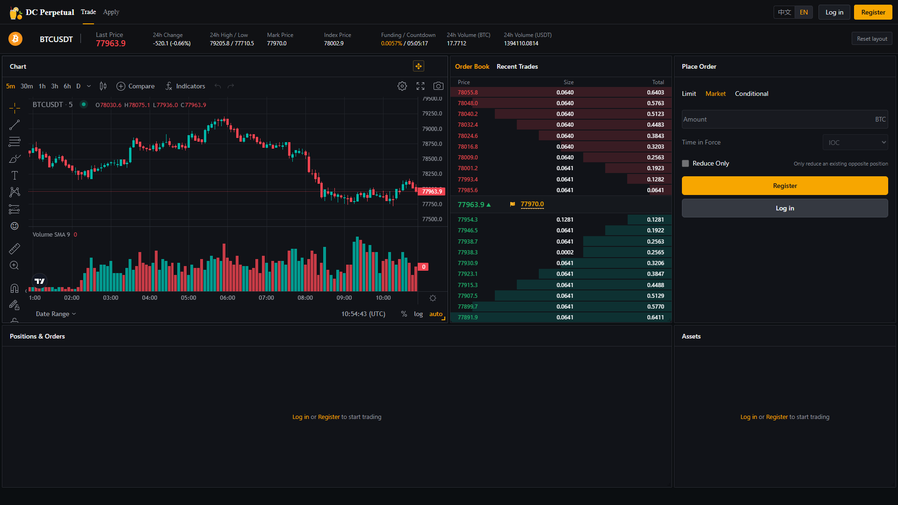
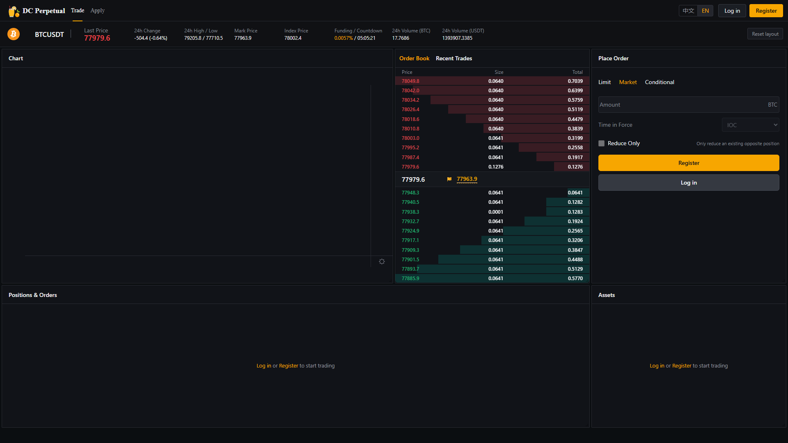
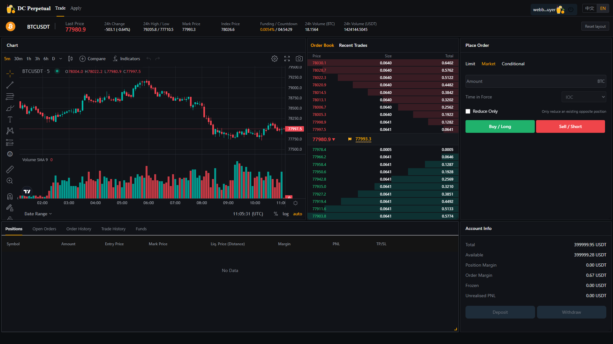

# MDSvr WebSocket 实时 K 线验收报告（2026-09-01）

## 1. 验收结论

`WEB_E2E / BTCUSDT / 5M` 的公共态和登录态均已使用以下唯一实时链路：

`MDSvr -> GW 订阅转发 -> 浏览器 WebSocket -> KLineHandler -> TradingView onRealtimeCallback`

前端不再运行两秒行情/K 线轮询，也没有调用 `queryPublicMarket` 兜底。`queryKLine` 只用于 TradingView 首次打开时加载 ClickHouse 历史数据，不参与实时刷新。

## 2. 发布版本

- LoginSvr 源码：`380a8f2`，增加受 location 限制的 `PUBLIC_MARKET` WebSocket 会话。
- Web 源码：`a6b4bc6`，移除实时轮询并修复 DC 上海时区时间戳；`97cf945` 增加可自动验收的实时推送状态。
- Web 公共镜像：`ghcr.io/bliplink/dc-saas-trade-web@sha256:cc513c78f7de5bb3fa92e8a405b3229cfa4d47a7af08bf29e477f17231596a5f`。
- 生产验证主机：`18.140.45.126`，独立 Compose 项目 `dc-saas`。
- 本次只替换 `dc-saas-loginsvr` 和 `dc-saas-trade-web`，没有变更 GW，也没有触碰量化系统容器。

## 3. 公共态浏览器验收

自动化脚本：`tests/web-public-market-e2e.js`

- 未登录直接打开 `/#/trade?location=WEB_E2E`：PASS。
- 公共 WebSocket 会话：PASS，未创建普通用户登录凭据。
- 订单簿：买 10 档、卖 10 档，累计深度条正常：PASS。
- 首次历史 K 线：返回并渲染 249 根，TradingView 画布 11 个：PASS。
- 实时 K 线：连续收到至少 2 次推送：PASS。
- 实时 topic：`dc.md.kline.5M.BTCUSDT.WEB_E2E`：PASS。
- 实时 K 线时间戳不超前：PASS。
- `queryPublicMarket` 轮询调用：0：PASS。
- 注册页面自动继承 `WEB_E2E` 且不能编辑租户：PASS。





## 4. 登录态浏览器验收

自动化脚本：`tests/web-authenticated-market-e2e.js`

- 通过 GW WebSocket 使用用户名/密码登录：PASS。
- LoginSvr 返回的权威 location 为 `WEB_E2E`：PASS。
- 登录后订单簿：买 10 档、卖 10 档：PASS。
- 登录后实时 K 线：连续收到 MDSvr 推送：PASS；诊断长窗口内实际观察到 48 次更新。
- 实时 topic：`dc.md.kline.5M.BTCUSDT.WEB_E2E`：PASS。
- `queryPublicMarket` 轮询调用：0：PASS。
- 页面 JavaScript/控制台错误：0：PASS。



## 5. ClickHouse 数据证据

验收结束时，`dc.kline` 查询结果如下：

```text
location=WEB_E2E
securityID=BTCUSDT
text=5M
rows=264
first_bar=2026-08-30 18:05:00
last_bar=2026-09-01 19:05:00
```

最新同一根 5M K 线在形成期间持续追加更新，样例：

```text
startTime=2026-09-01 19:05:00
open=78004 high=78022.2 low=77930.9 close=77957.9 volume=0.01
createTime=2026-09-01 19:06:21.026
```

这与浏览器收到的同 location、同品种实时 topic 相互印证：历史数据来自 ClickHouse，当前 K 线变化来自 MDSvr WebSocket 广播。

## 6. 验收边界

本报告证明公共态与登录态行情/K 线实时链路正常且无两秒轮询兜底。Robot 持续流量环境下，旧的固定价双用户 Web 撮合脚本会被 Robot 更优价格优先成交，因此固定 `60000` 必须留在无 Robot 的核心撮合租户验收；不能把它作为 `WEB_E2E` 行情推送是否正常的判断依据。
