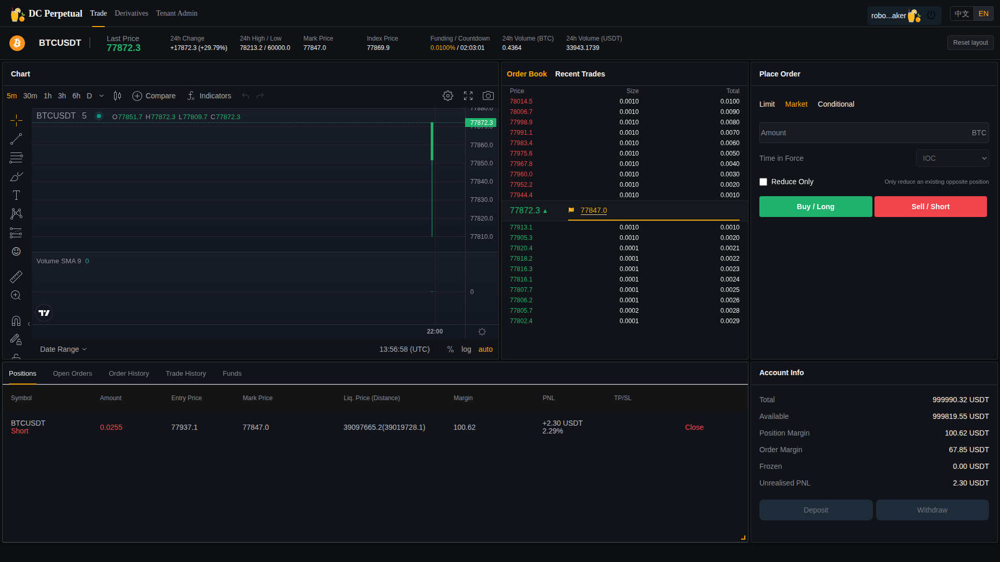

# Robot 持续报价与混合交易运行报告

日期：2026-08-31  
环境：`18.140.45.126`  
租户：`WEB_E2E`  
品种：`BTCUSDT`  
状态：常驻运行中

## 1. 结论

Robot 已在 `WEB_E2E` 启动持续 10 档买价与 10 档卖价，并由四个模拟用户循环执行双向 IOC 点价、价差内 GTC、被动挂单及批量撤单。服务器安装了分钟级守护任务；负载进程异常退出时自动拉起，Web 浏览器监控容器使用真实 WebSocket 登录并以 250ms 频率检查用户实际看到的盘口。

最终版本 `387bdf7` 的干净观察窗口通过：Robot 权威状态为 `RUNNING`；数据库每侧始终不少于 10 个不同价位，换价时仅短暂保留有限桥接报价；Web 始终只展示前 10+10 档。浏览器断档、页面错误、混合请求拒绝和负余额均为 0。任务在报告生成后继续运行，本报告不把小时内观察窗口等同于长期稳定性结论。

## 2. 实施内容

- Robot：`continuous-depth10`，API 用户 `robotsoakmaker`。
- 模拟用户：`robotsoak01` 至 `robotsoak04`。
- 行情源：APSSvr 的 Binance Futures book ticker。
- 盘口：10 bid + 10 ask，租户 tick size `0.1`、qty step `0.0001`。
- 报价刷新：200ms；行情过期保护：3 秒；偏离熔断：500 bps。
- 用户流量：每轮并发 4 个订单，包含买 IOC、卖 IOC、价差内 GTC 和被动 GTC；周期性撤销用户剩余活动单。
- Web 监控：真实浏览器、真实 GW/LoginSvr/MDSvr、250ms DOM 采样，每 10 分钟更新健康截图。
- 守护：root crontab 每分钟执行 `start`，文件锁保证只有一个负载进程。

## 3. 首轮发现与修复

首轮运行真实发现并修复了以下问题：

1. `WEB_E2E` 租户品种的精度字段为空，Robot 回退到 0.01，而 OrderSvr 使用全局 0.1，导致价格被拒绝。常驻脚本现在从全局品种补齐租户规则并按租户 tick 生成测试订单。
2. 新建模拟账户已写 MySQL，但 TradeSvr/OrderSvr 内存缓存未热加载。脚本仅在首次安装时停用 Robot，重载 LoginSvr/OrderSvr/TradeSvr/GW，路由恢复后再启用。
3. 旧 Robot 换价采用“先撤全部旧价、再逐笔报新价”，Web 250ms 采样捕获到 0–9 档窗口。RobotSvr `1a95cfe` 改为按行情方向分侧切换：上涨先确认新卖盘再换买盘，下跌相反；新报价未全部活动前不撤旧侧。
4. Robot 过去以“期望报价数”上报 `open_order_count`。RobotSvr `2e39933` 改为查询实际活动委托，数量不符时进入降级/错误，禁止虚假 `RUNNING=20`。
5. 守护脚本早期 PID 文件可能被并发启动覆盖。现使用 `flock` 单实例锁，`stop` 会检查并终止所有同类残留进程。
6. Web 监控与下单用户曾复用会话，且价差单未使用租户 tick，产生测试工具自身的拒绝噪声。最终监控使用 Robot 专用账号，所有模拟价格按数据库 tick 量化。
7. 高并发时 OrderSvr/GW 的活动单查询可见性偶尔晚于下单响应。旧逻辑连续三次确认超时会撤掉全部报价，真实 Web 因此出现缺档。`a1ec57a` 将这种情况改为可重试的 `QUOTE_RECONCILIATION_RETRY`，保留已有盘口，不再因查询延迟主动清空。
8. 仅用“下单前总数 + 缺失数”确认换价会因部分成交和延迟可见而失真，中间版本一度留下 1,377 笔活动测试报价。最终 `387bdf7` 按不同价格档位控制每侧深度：优先保留本轮目标价格，不足时保留距离目标最近的旧价格，其余分批撤销，从而同时满足不缺档和不无限累积。
9. 大量活动报价一次性提交 `cancelBatchOrder` 会超过实际处理能力。`9470bd3` 将停机/恢复撤单固定为每批 50 笔，一批失败仍继续其他批次；生产验证把 1,377 笔遗留活动单清理为 0。

## 4. 干净窗口结果

最终干净窗口开始：2026-08-31 22:01（Asia/Shanghai）。启动预热、受控镜像切换和修复前数据均已单独归档，不进入本表。

| 项目 | 结果 | 证据 |
|---|---|---|
| Robot 状态 | PASS | 最终采样为 `RUNNING`，无错误码；换价完成时实际活动报价收敛为 20 |
| 数据库盘口 | PASS | 每次干净采样 `bid_levels>=10`、`ask_levels>=10`；桥接报价有硬上限并持续收敛 |
| Web 可见盘口 | PASS | 真实 Chromium 每 250ms 读取用户实际看到的前 10+10 档 |
| Web 断档 | PASS | 最终镜像部署以来 `gapSamples=0` |
| Web 页面错误 | PASS | `pageErrors=[]` |
| 混合请求 | PASS | 四用户每轮并发 4 单；accepted 持续增长、rejected=0 |
| 最近订单拒绝 | PASS | 最终窗口 MySQL `Rejected=0` |
| 成交 | PASS | IOC 点价持续产生 Robot/用户双方 execution |
| 持仓守恒 | PASS | 测试账户多头合计始终等于空头合计 |
| 负余额/负保证金 | PASS | 0 个账户 |
| 服务错误日志 | PASS | Robot/Order/Trade/MD 最近 5 分钟无 error/exception/degraded |
| 单实例 | PASS | 仅一个 `run-robot-market-soak-host.sh run` 进程 |
| 自动恢复 | PASS | 主动终止 PID `3160258` 后，root cron 自动拉起 PID `3202116`；恢复期间 Robot/Web 行情不断 |

Web 健康截图（SHA-256：`939046202e4c5a474b75ab6744a69191126623f43dd8363a8a1179ad52794e0b`）：



资源快照：

| 服务 | CPU | 内存/上限 |
|---|---:|---:|
| RobotSvr | 3.27% | 133 MiB / 384 MiB |
| OrderSvr | 6.78% | 276.1 MiB / 640 MiB |
| TradeSvr | 2.35% | 260.1 MiB / 896 MiB |
| MDSvr | 2.41% | 431.3 MiB / 640 MiB |
| GW | 6.21% | 254.5 MiB / 384 MiB |
| Trade Web | 0.21% | 8.5 MiB / 256 MiB |
| MySQL | 21.21% | 729 MiB / 1.5 GiB |

## 5. 运维命令

```bash
cd /home/ec2-user/dc-saas-deploy

# 查看 Robot、Web 监控和最近盘口采样
sudo ./tests/run-robot-market-soak-host.sh status

# 安装/修复分钟级守护并立即启动
sudo ./tests/run-robot-market-soak-host.sh install

# 仅停止模拟流量和 Web 监控；Robot 配置保持启用
sudo ./tests/run-robot-market-soak-host.sh stop

# 查看连续运行日志
sudo tail -f /data/dc-saas-runtime/robot-soak/load.log
sudo docker logs -f dc-saas-robot-web-monitor
```

运行数据位于 `/data/dc-saas-runtime/robot-soak`。`runtime.env` 为 root-only 测试凭据，不进入 Git；旧版断档截图和修复前指标已归档在同一目录用于对比。

## 6. 当前边界

- 当前验证的是租户内部报价、撮合、盘口连续性、Web 展示和服务并发；`hedge_enabled=0`，没有真实 Binance 账户反向对冲。
- 常驻模拟用户会持续产生订单、成交、持仓、资金和 K 线数据，只允许用于 `WEB_E2E` 验收租户，不得指向真实资金租户。
- 初始窗口证明修复后的实时行为正常；仍需通过持续小时级/天级统计、服务重启、Binance 断流、价格跳变和数据库短断等故障注入，形成长期稳定性结论。
