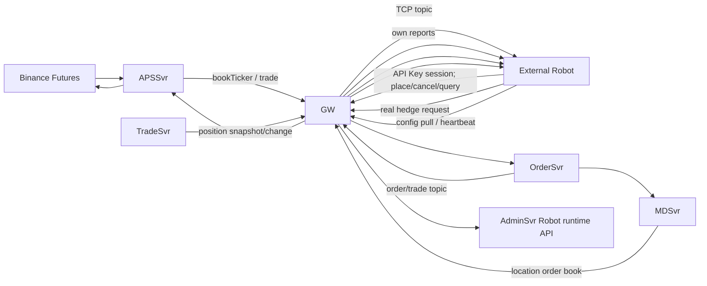

# Robot 外置策略架构与实施方案

## 1. 架构结论

Robot 是交易平台之外的标准策略客户端，不是交易核心服务。它只能连接 GW，不得直连 MySQL、ClickHouse、LoginSvr、OrderSvr、TradeSvr、MDSvr、APSSvr 或这些服务的进程端口。

平台对 Robot 暴露的能力与普通 API 交易客户端一致，只增加受限的 Robot 配置读取和运行状态上报能力。GW 保持通用转发职责，租户和用户权限仍由 LoginSvr 认证会话及下游服务校验。

## 2. 目标数据流

## 3. 身份和订单规则

- 每个 Robot 固定绑定 `location + robot_id + security_id + maker API key`。
- 模拟成交使用独立的 tape API 用户，禁止 maker 与 tape 使用同一用户，避免自成交保护阻断模拟逐笔。
- Robot 内部报价、sweep 和 tape 订单统一使用 DC 协议 `Demo/Isdemo=1`，仅进入 OrderSvr 内存订单簿、撮合、MDSvr 行情和实时回报，不写 `dc_orders` 与 `dc_orders_execorders`。
- 普通用户订单仍正常落库。用户与 Robot 成交后，用户侧订单、成交、资金和持仓保持完整业务记录。
- Binance 真实对冲单必须使用 `Demo=0`，并与内部流动性单使用不同的 clientOrderId 前缀和审计域。

## 4. 实时行情、成交与对冲

### 4.1 外部行情

Robot 通过 GW TCP 长连接订阅：

- `dc.bookticker.BNFutures.<SYMBOL>`：驱动参考价、档位价格、陈旧行情保护和熔断。
- `dc.trade.BNFutures.<SYMBOL>`：驱动模拟成交价格与成交额缩放。

APSSvr 是唯一 Binance 公共行情入口。Robot 不再自行直连 Binance 公共行情 WebSocket。

### 4.2 本系统盘口

Robot 通过 GW 订阅租户 MDSvr 的 `location + symbol` 订单簿。为了吃掉进入保护区的用户挂单，Robot 比较：

1. MDSvr 聚合盘口；
2. OrderSvr 返回的 Robot 自己活动单；
3. 外部 Binance 买一/卖一保护边界。

聚合盘口中扣除 Robot 自有数量后仍存在的价格/数量视为用户流动性。只有用户订单越过配置边界，Robot 才发 IOC sweep；不需要、也不允许查询其他用户的订单表或身份。

### 4.3 内部成交

Robot 通过已认证 GW 会话订阅自己的 OrderSvr 订单和成交 topic。成交回报是对冲的实时触发源；不能通过轮询平台数据库发现成交。

### 4.4 外部对冲

- 每次内部成交先更新 Robot 本地净敞口，再计算 `目标外部仓位 = -内部 Robot 净持仓`。
- 对冲增量达到品种数量步长后，经 `GW -> APSSvr -> Binance Futures` 下 Market 单。
- clientOrderId 必须确定且唯一。发送前写 Robot 自己的本地追加式 journal；该 journal 属于外置策略的恢复数据，不访问平台数据库。
- 响应不确定时停止新报价，用同一 clientOrderId 经 GW/APSSvr 查单；未查清前禁止再次发送相同敞口的全量对冲。
- 启动和固定周期通过 TradeSvr 持仓快照及 Binance 仓位/订单查询做对账。快照是恢复和校验路径，不是实时成交触发路径。

## 5. Robot 可使用的 GW 能力

| 能力 | 下游服务 | 权限范围 |
| --- | --- | --- |
| API Key 登录/恢复会话 | LoginSvr | 只能建立 API key 所属用户和 location 的会话 |
| Binance bookTicker/trade 订阅 | APSSvr | 公共行情 |
| 租户订单簿订阅 | MDSvr | 只允许会话 location |
| 下单、撤单、活动单查询 | OrderSvr | 只允许会话 user + location |
| 订单与成交回报订阅 | OrderSvr | 只允许会话 user + location |
| 余额、持仓快照及更新 | TradeSvr | 只允许会话 user + location |
| 外部对冲下单/查单 | APSSvr | 只允许绑定的对冲账户别名和品种 |
| Robot 配置读取/心跳 | AdminSvr | 只能访问 API key 绑定的 robot_id，不能使用租户管理员接口 |

## 6. 配置和密钥

- 租户管理员仍在独立租户管理页设置档位、价差、资金分区、数量、库存、sweep、tape、熔断和对冲开关。
- AdminSvr 为 Robot 提供只读运行配置接口；返回值必须按已认证 API key 反查 robot，不接受客户端传入 location 覆盖。
- Robot maker/tape API Secret 只在创建时交付给外置 Robot，平台列表接口不回显 Secret。
- Binance Key/Secret 不经普通租户配置查询接口返回。外置 Robot 通过本地 secret 文件或 secret manager 注入，只把对冲账户别名上报平台。
- Robot 镜像和一键部署不再需要 `MYSQL_URL/MYSQL_USERNAME/MYSQL_PASSWORD`。

## 7. 实施顺序

### P0-A：协议和落库边界

1. quote、sweep、tape 全部标记 `Demo/Isdemo=1`。
2. 外部 hedge 保持 `Demo=0`。
3. 验证 OrderSvr 内存活动单 20/40 档存在，Web 盘口正常，同时 Robot 订单和执行表无新增记录。

### P0-B：只走 GW 的运行数据

1. 增加 Robot 自有订单、成交、持仓和租户订单簿订阅。
2. 用实时成交回报更新内部敞口并触发对冲。
3. 用 MDSvr 聚合盘口减去自有活动单代替 `bestUserOrders()` 数据库查询。
4. 用 TradeSvr 持仓快照代替 `dc_orders_position` 查询。

### P0-C：只走 GW 的控制面

1. AdminSvr 增加 Robot 受限配置拉取、租约申请/续租、心跳、停用确认接口。
2. 接口按服务端 API key 身份绑定 location/robot_id，禁止客户端伪造。
3. RobotSupervisor 用 GW 配置接口代替 `dc_tenant_robot` 直连。

### P0-D：本地恢复和移除数据库依赖

1. 增加外部对冲本地 journal、原子落盘和启动恢复。
2. 完成活动单、内部持仓、外部仓位三方对账。
3. 删除 RobotRepository JDBC 实现、MySQL 驱动和所有 MySQL 环境变量。
4. CI 增加静态门禁：RobotSvr 不得依赖 JDBC/MySQL，不得出现后端服务直连地址。

## 8. 验收门禁

- 断开 Robot 到 MySQL/ClickHouse/各后端端口的网络后，行情、报价、成交、补档和查询继续正常。
- 只放通 Robot 到 GW 的 TCP/HTTP 端口后，全链路通过。
- APSSvr 行情中断时在陈旧阈值内撤掉内部报价；恢复后无需重启 GW 或 Robot 自动恢复。
- 用户连续点价时，成交回报到对冲请求的 P99 延迟达到配置门禁，且数据库轮询次数为零。
- Robot 重启、GW 重启、对冲请求超时、Binance 部分成交和查单超时均不产生重复对冲。
- Robot 活动报价在 OrderSvr/MDSvr/Web 可见，`dc_orders` 与 `dc_orders_execorders` 中 Robot 内部订单新增数为零。
- 普通用户侧委托、成交、持仓、余额和资金流水完整，租户隔离不被 Demo Robot 订单削弱。

## 9. 当前差距

截至 2026-09-02，行情订阅、下单/撤单/查活动单和外部对冲请求已经经过 GW，但仍存在以下直连平台数据库路径，尚不符合最终边界：

- `RobotRepository.listRunnable/tryAcquire/heartbeat/release`
- `RobotRepository.netPosition`
- `RobotRepository.bestUserOrders`
- `dc_robot_hedge_execution` 的直接读写
- API Key 登录仍使用独立 LoginSvr HTTP 地址，而不是 GW 登录入口

因此当前版本只能称为“平台内 RobotSvr”，不能称为完全外置策略。完成 P0-B、P0-C、P0-D 并通过只放通 GW 的网络验收后，才能更新该结论。
