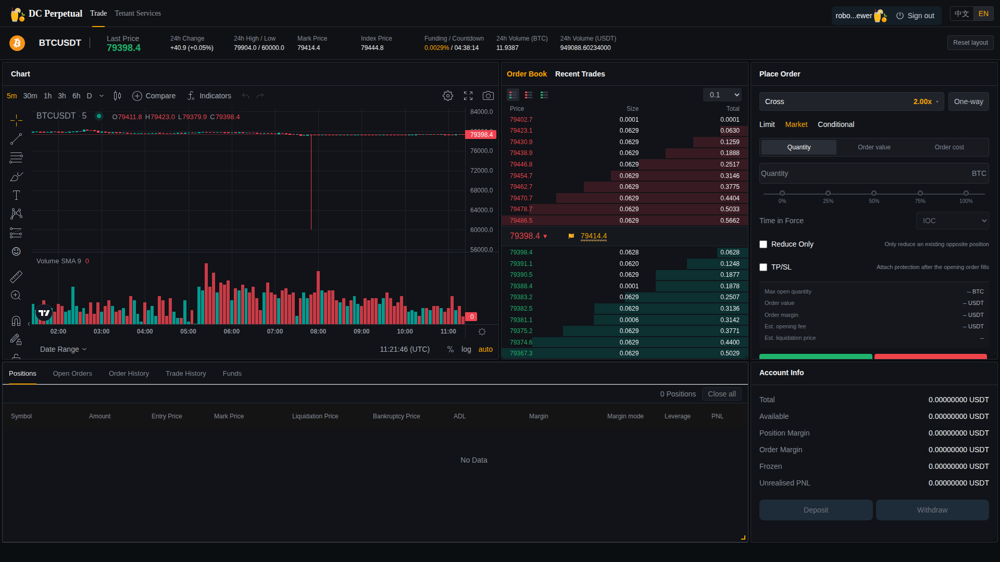

# Robot GW-only、租户盘口与交易 Web 生产验收报告（2026-09-07）

## 1. 结论

本轮发布完成了 Robot 外置策略化、GW-only 接入、20 档流动性、MDSvr 租户盘口稳定发布和交易 Web 10 档完整显示。生产目标租户 `WEB_E2E` 的 Robot 持续维持 BTCUSDT 买 20 档、卖 20 档；MDSvr 与 Web 对外显示买 10 档、卖 10 档。

最终稳态观察窗口为 `2026-09-07 11:21:41 UTC` 至 `2026-09-07 11:27:26 UTC`。窗口内 Robot 保持 `RUNNING/40`，MDSvr 快照最小买卖档为 `10/10`，Web 高频采样最小买卖档为 `10/10`，页面错误 `0`，混合订单新增接受 `1036`，新增拒绝 `0`，新增盘口缺档 `0`。

真实 Binance 对冲仍关闭，未使用真实资金账户发单，因此不把“真实对冲生产验收”列为通过项。

## 2. 发布版本

| 组件 | 分支 / 提交 | 生产镜像 |
| --- | --- | --- |
| RobotSvr | `saas-crypto` / `54903410cc7db0956d0f8d7ecbe185dfd5aa96f5` | `ghcr.io/bliplink/robotsvr:sha-54903410cc7db0956d0f8d7ecbe185dfd5aa96f5` |
| RobotSvr manifest / image ID | - | `sha256:5cea4d1f05ddc4e6db6a2b5487f1b0481bb4a5014803045f6f48abd17720b9bb` / `sha256:2b8187e138837fef3d1618ded2e473e1068749388671eed2aa01a3eda06c95dc` |
| MDSvr | `saas-crypto` / `74bb67f` | `ghcr.io/bliplink/mdsvr:sha-74bb67f` |
| MDSvr manifest / image ID | - | `sha256:aff53e27020d2c8196da2a9254f49ad5408f02f4e9ca9e70364b91808a9f97cf` / `sha256:e758231a06d48ed5fb38211d4672f35ec9cd1a2507a65dd0e2f34a4c42721548` |
| 交易 Web | `saas-crypto` / `03b10b25f13a14d41fd58db59eee97aac4966e6e` | `ghcr.io/bliplink/dc-saas-trade-web:saas-crypto` |
| Web manifest / image ID | - | `sha256:1c4fdfc331ed5b3040dce309d068270d486853d162bf0de97080766a6b0d79ce` / `sha256:7614b36c7cd5dcdf6c67ccbe51b9546be2fa71a6bc4ba4008032a02e7a7ea66e` |
| 部署与监控 | `saas-crypto` / `d4520ea` | DOM 行数与可见行数分别采样 |

生产 Robot 使用滚动分支标签；MDSvr 固定为不可变 SHA 标签。Robot 分支标签、不可变 SHA 标签和运行容器均解析到同一 image ID。

## 3. 实现内容

### 3.1 Robot 仅访问 GW

- Robot 用租户 API Key 完成身份引导，再用返回 token 建立 GW TCP API 会话。
- 下单、撤单、活动委托、持仓、行情、成交回报、配置、租约、心跳和对冲流水都经 GW 转发。
- APSSvr 的 Binance `bookTicker`、`depth`、`trade` 经 GW TCP topic 到 Robot。
- 私有成交 topic 绑定 `user + location + symbol`；实时成交是对冲主路径，30 秒执行回报扫描仅做漏报恢复。
- 容器环境没有 MySQL、ClickHouse、JDBC 或其他后端服务直连配置，源码静态扫描也没有 JDBC/SQL 访问。

### 3.2 20 档报价与资金规则

生产配置如下：

| 参数 | 值 |
| --- | --- |
| 租户 / Robot | `WEB_E2E` / `continuous-depth10` |
| 内部买档 / 卖档 | `20 / 20` |
| Web 买档 / 卖档 | `10 / 10` |
| 保证金预算 | `100,000 USDT` |
| 杠杆 | `2x` |
| 近 / 中 / 远档位 | `6 / 6 / 8` |
| 近 / 中 / 远权重 | `3 / 3 / 4` |
| 数量模式 | `NOTIONAL_ZONES` |
| 报价刷新 | `1000 ms` |
| 行情陈旧阈值 | `3000 ms` |
| 真实对冲 | 关闭 |

QuoteEngine 已使用租户配置的 `3:3:4`，不再使用旧硬编码权重。Binance `bookTicker` 静默时以同源 `depth` 事件更新行情新鲜度，避免成交和深度仍正常时误判 `STALE`。

### 3.3 MDSvr 与 Web 盘口稳定性

本轮严格验证发现并修复两个不同问题：

1. Web 盘口 DOM 有 10 行但第 10 行曾因 flex 高度被裁切。Web 改为固定 10 行网格，并保留 Bybit 风格累计量背景进度条。
2. MDSvr 深度模式曾把旧原始快照与新深度簿快照发布到同一 topic，且极短暂的不完整深度可能进入异步队列，稍后覆盖 Web。现在深度模式只由 `DepthBookFacade` 发布权威兼容盘口；已有完整 10/10 时，1 秒内恢复的不完整中间态不入队，持续超过 1 秒的真实短缺仍会发布，避免长期显示虚假订单。

对照诊断中，MDSvr HTTP 以 10Hz 连续查询 440 次，错误 0、缺档 0、最小买卖档 10/10；同时旧 WebSocket 队列曾出现 8/9 行，证明问题位于异步 topic 发布链而不是 CSS 或查询接口。

## 4. 自动化测试

| 测试集 | 结果 |
| --- | --- |
| RobotSvr Maven | 42 项，失败 0，错误 0 |
| MDSvr Maven | 27 项，失败 0，错误 0 |
| Web order book | 3 项通过 |
| Web K 线 | 4 项通过 |
| Web LESS | `lessc --lint` 通过 |

覆盖内容包括 API Key TCP 会话、私有成交订阅、20 档与 3:3:4 分配、报价替换、自成交保护、行情陈旧判断、实时成交对冲队列、MDSvr 单一权威发布、短暂不完整快照门控、订单簿聚合和 K 线实时重放。

## 5. 生产验收

### 5.1 进程与资源

- Robot 容器状态 `running`，重启计数 0；JVM `-Xms32m -Xmx256m -Xmn64m`。
- Robot 实测内存约 118 MiB，容器限制 384 MiB。
- MDSvr 容器状态 `running`，重启计数 0，运行不可变镜像 `sha-74bb67f`。
- Web 容器状态 `running/healthy`，重启计数 0。
- 发布 MDSvr 时 Robot 因依赖不可用按预期 fail-closed；MDSvr 重新注册后 Robot 自动恢复为 `RUNNING/40`。该恢复期不计入稳态窗口。

### 5.2 行情与混合压力

- 4 个独立用户持续并发执行买入点价、卖出点价、价差内挂单、远端 GTC 挂单和周期撤单。
- 最终窗口 MDSvr 采样行数 `260`，买卖档范围均为 `10..10`，非 `RUNNING` 行数 `0`，Web 非 200 行数 `0`。
- 15 次独立行情抽样中，最优买价有 2 个不同值，最优卖价有 8 个不同值，证明盘口持续变化而不是静态图片。
- Web 监控以 250ms 采样 DOM 行数、可见行数、K 线状态和页面错误。

最终窗口 Web 截图：

### 5.3 Demo 订单持久化边界

- Robot maker、sweep、tape 报单均明确设置 `Demo/Isdemo=1`；真实 Binance hedge 明确设置 `Demo=0`。
- 数据库中存在 2026-09-02 以前遗留的 Robot 前缀订单，不能用全表总数证明当前行为。
- 按时间核对，目标 Robot 前缀订单最新持久化时间停留在 `2026-09-02 11:50:38.729`，本轮 2026-09-07 持续报价没有新增同前缀订单。
- 持久化判定属于 OrderSvr；本轮遵照并行开发约束，没有修改或发布 OrderSvr。

### 5.4 安全核验

- Robot 当前源码已删除旧适配器内硬编码的 API Key、secret 和服务地址，且不再打印凭据。
- Robot 日志配置屏蔽底层 GW 客户端的完整迟到登录响应，生产最终日志中 `drop cmd`、`token`、`sid` 明文计数均为 0。
- 旧凭据曾进入 Git 历史；删除当前源码不能使历史值失效，相关 API Key/secret 必须轮换或吊销。

## 6. 未完成或不宣称通过

1. 真实 Binance 对冲：`hedge_enabled=0`，尚未用专用小额 Futures 账户验证真实下单、部分成交、超时查单、限频、幂等和熔断。
2. 网络层强隔离：Robot 已无数据库依赖，但按当前部署决定尚未用防火墙或独立 Docker 网络做到网络层只放行 GW。
3. OrderSvr 正由另一会话改造；本轮只记录 Demo 历史数据边界，没有改动该服务。

提供专用小额 Binance Futures 测试账户后，应先配置极小的单笔对冲量和总损失上限，再验收真实成交触发延迟、幂等、部分成交与异常恢复；没有真实账户证据前，不把该项标记为完成。
