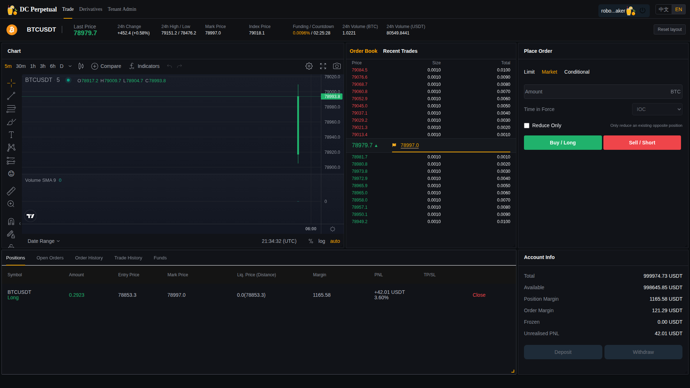

# Robot 持续报价与行情重连加固验收（2026-09-01）

## 1. 验收范围

- 环境：生产独立 SaaS 部署 `18.140.45.126`，租户 `WEB_E2E`，品种 `BTCUSDT`。
- 链路：币安行情 → APSSvr → GW → RobotSvr → OrderSvr → MDSvr → GW WebSocket → Web 订单簿。
- 目标：Robot 持续双边 10 档报价；用户混合下单、点价和撤单持续运行；APSSvr 重启后系统自动保护并恢复，不依赖人工重启 GW。
- 隔离：本次只操作 `dc-saas-*` 容器及 SaaS 分支/镜像，未修改量化系统容器和 `latest` 镜像标签。

## 2. 本轮发现并修复的问题

### 2.1 长时间压测会话过期

持续负载用户的登录会话约一小时后过期，原脚本把认证失败计入业务拒单。压测脚本现支持 2700 秒主动刷新及错误码 `1004` 被动刷新，并单独统计 `auth_refreshes`。

### 2.2 Web 监控进程存活但浏览器渲染器失效

Node 容器仍为 `Running` 时，Chromium 渲染器可能已经 OOM 或停止采样。监控现每秒写心跳、每 10 分钟轮换浏览器，并由宿主脚本在心跳过期时重建容器。监控容器的 OOM 状态已验证为 `false`。

### 2.3 APSSvr 重启后 GW 不恢复后端订阅

GW 原逻辑只在后端第一次连接时订阅，断开后不会重新注册；即使再次调用 `subscribe`，底层客户端也会因相同 listener 而去重。修复后，每个断开—重连周期执行一次显式 `unsubscribe → subscribe`，重复 `connected` 回调不会重复注册。

### 2.4 Robot 客户端陈旧订阅

Robot 对陈旧行情执行有界的显式退订/重订，并在持续无行情时重建自己的 GW 会话。该逻辑只影响 Robot 客户端，不改变租户权限或 GW 业务路由规则。

### 2.5 Web 档位监控误计数

交易页已在展示边界将买卖盘分别排序并截取前 10 档。旧监控跨多个布局 DOM 容器累加行数，可能错误报告 20 档；现只统计当前可见的订单簿容器，并记录总容器数和可见容器数。

### 2.6 GW HTTP 回调线程随连接增长

旧 GW 为每个 HTTP handler/连接创建一组 8 线程的 `AsynHttpMsg`，持续运行曾达到 1,162 个线程。源码修订 `6702148` 改为进程级共享回调组；最终干净窗口保持约 107–114 个线程和 208–252 MiB。

### 2.7 TradeSvr 入站消息使用无界线程池

`gateway-api` 3.0.1 使用无界 cached thread pool，3000×32 撮合时 TradeSvr 达到约 4,381 个线程。`gateway-api` 3.0.2 改为有界固定线程池和调用方背压，部署设置 32 worker/10,000 队列；同规模复测保持 169–170 PID、259–279 MiB。

## 3. 自动恢复故障验收

最终使用镜像：

- GW：`ghcr.io/bliplink/gw:saas-crypto`，源码修订 `6702148`。
- RobotSvr：`ghcr.io/bliplink/robotsvr:sha-06d101d6aed3d4c9859fa77e725aa8102567d8b4`。
- TradeSvr：`ghcr.io/bliplink/tradesvr:sha-e97b8cca1e2606e72e34042d7c38eb92e2d800ba`，只包含 `gateway-api-3.0.2.jar`。

最终故障时间线（UTC）：

| 时间 | 事件 | 结果 |
|---|---|---|
| 21:32:43 | 停止 `dc-saas-apssvr` | 故障前 Robot 为 `RUNNING/20`、数据库 10+10 |
| 21:32:47 | 行情超过陈旧阈值 | 4 秒内自动撤单并进入 `STALE/0` |
| 21:33:08 | 启动 APSSvr | 不重启 GW 和 RobotSvr |
| 21:33:53 | 首个 ask 恢复 | 后端发现与订阅自动重建生效 |
| 21:33:55 | Robot 完成盘口重建 | 恢复 `RUNNING/20`、买卖各 10 档 |

结论：APSSvr 重启后的自动恢复已通过，不再需要人工重启 GW。当前主要恢复耗时约 47 秒来自底层服务发现/连接超时，属于下一阶段可优化的 RTO，不影响本次“能够自动恢复”的正确性结论。

## 4. 回归测试结果

- RobotSvr：32 个单元测试通过，0 失败、0 错误。
- GW：7 个回归测试通过，0 失败、0 错误。
- gateway-api：1 个有界线程池回归测试通过；com.app.dc：7 个测试通过；TradeSvr：63 个测试通过。
- Web：订单簿展示代码固定为每侧最多 10 档；监控已改为可见容器口径。
- 运行状态：GW、APSSvr、OrderSvr、TradeSvr、MDSvr、RobotSvr、LiqSvr 均为 `running`，RestartCount=0，`OOMKilled=false`。
- 混合负载：Robot 报价期间，多个用户持续执行限价单、IOC 点价、撤单；故障恢复后接受计数继续增长。

GW 修复后的 305.3 秒干净窗口新增请求接受 416、拒绝 0、数据库缺档 0；真实 Chromium 新增 1,188 个采样，买卖盘最小/最大均严格为 10/10，缺档 0、页面错误 0。APSSvr 故障恢复后的 141 秒窗口新增接受 156、拒绝 0、数据库缺档 0、Web 新增 544 个严格 10+10 样本。

## 5. 后续工作

1. 将 APSSvr 服务发现恢复时间从约 47 秒压缩到 10–15 秒，并验证不会造成网络抖动下的重连风暴。
2. 保持常驻 Robot/Web 混合流量，完成 24 小时无故障窗口和数据库、网络、服务重启故障矩阵。
3. 继续提升压力阶梯，分别确定 OrderSvr、TradeSvr、MDSvr、GW 和 MySQL 的容量拐点及 SLO。
4. 使用专用 Binance 测试或小额账户验收真实反向对冲；当前 `hedge_enabled=0`，不得标记为通过。
