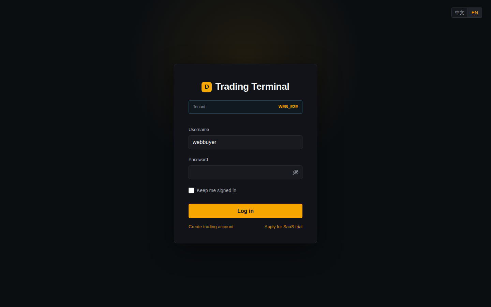

# WebSocket 会话恢复生产验收报告

文档版本：V1.0  
验收日期：2026-08-31  
代码分支：`saas-crypto`  
生产环境：`18.140.45.126`  
验收租户：`WEB_E2E`

## 1. 验收结论

WebSocket 会话恢复已实现并在生产 SaaS 环境通过端到端验收，结论为 **PASS**。

本次实现复用 GW 现有 `CONNECT/login` 协议。首次登录发送用户名和密码；刷新或断线恢复发送用户名和上一次 token，并由 LoginSvr 进行 token 认证和一次性轮换。GW 未修改源码、未增加会话存储，也未加入 SaaS 租户业务逻辑。

验收覆盖页面刷新、真实 WebSocket 连接中断、旧 token 重放、跨租户冒用、显式退出撤销、密码不落浏览器存储，以及登录后完整下单、撤单、成交、平仓、资金、盘口、最近成交和 K 线回归。

## 2. 发布基线

| 组件 | Git 基线 | 生产镜像 | 状态 |
|---|---|---|---|
| LoginSvr | `46d411c` | `ghcr.io/bliplink/loginsvr:saas-crypto`，manifest `sha256:90b8fa3f26b1d121005dde7640320d0bfd5a431be6b5a742ae2c37cd30d7e97a` | 已部署，运行中 |
| dc-trade-web | `d9f69fa` | `ghcr.io/bliplink/dc-saas-trade-web:saas-crypto`，manifest `sha256:01b524a7fe3599441cbbb288d0f4ffd220f276a95bed7ef3adeebf74f958451a` | 已部署，healthy |
| GW | 零代码改动 | `ghcr.io/bliplink/gw:saas-crypto` | 复用现有 login 透传 |
| 部署与 E2E | `597b21d` | `/home/ec2-user/dc-saas-deploy` | 已部署 |

生产容器实际 image ID：

- LoginSvr：`sha256:a03c3735c95767d53226cee2d398657aeead9a31df66cb9510791851badcc836`
- dc-trade-web：`sha256:649814bff2518745a1e48e0dd91595f653e53a9052258413cd48907ddce173d0`

## 3. 认证与恢复数据流

```text
密码登录
  Web -> GW CONNECT(userName, password, authType=PASSWORD, URL location)
      -> LoginSvr 校验用户、密码、租户
      -> 创建 256 位随机 token
      -> GW 绑定已认证 SID

刷新/断线恢复
  Web -> GW CONNECT(userName, oldToken, authType=TOKEN, URL location)
      -> LoginSvr 校验 session、用户、租户、客户端、有效期
      -> MySQL 事务原子轮换 oldToken -> newToken
      -> GW 按原流程绑定新 SID
      -> Web 保存 newToken 后恢复业务订阅
```

密码不写入 `localStorage` 或 `sessionStorage`。默认 token 只保存在 `sessionStorage`；用户勾选“保持登录”后才使用 `localStorage`。URL location 与保存会话不一致时禁止恢复。

## 4. 会话恢复专项验收

自动化脚本：`tests/run-web-session-resume-e2e-host.sh`。

测试通过真实浏览器、真实 GW/LoginSvr/MySQL 运行。断线场景不是浏览器离线模拟，而是在页面保持打开时重启 `dc-saas-trade-web`，使现有 WebSocket 真实断开，再验证自动重连认证和订阅恢复。

| 场景 | 结果 | 硬断言 |
|---|---|---|
| 首次 WebSocket 密码登录 | PASS | 返回认证用户、`WEB_E2E` 和随机 token |
| 页面刷新恢复 | PASS | 自动恢复原用户与租户，token 完成轮换 |
| 真实连接中断恢复 | PASS | 重连后先 token 登录，认证成功后恢复业务订阅 |
| 一次性 token | PASS | 轮换前旧 token 重放失败，同一旧 token 只能成功一次 |
| 跨租户冒用 | PASS | 修改 location 后恢复失败，且不消耗当前合法 token |
| 当前会话可用 | PASS | 新 SID/token 可继续请求 `userInfo` 和交易业务 |
| 显式退出 | PASS | 删除数据库会话，本地凭证清除，旧 token 无法再登录 |
| 密码存储检查 | PASS | 浏览器存储不存在密码及旧版 `userRemember.info2` |

自动化结果原文：

```json
{
  "status": "PASS",
  "location": "WEB_E2E",
  "user": "webbuyer",
  "refreshResume": true,
  "disconnectResume": true,
  "oneTimeRotation": true,
  "crossLocationRejected": true,
  "logoutRevoked": true,
  "passwordPersisted": false,
  "artifact": "websocket-session-logout.png"
}
```

退出后实际页面如下。租户由 URL 自动识别为 `WEB_E2E`，用户名可保留，密码为空，页面不保留伪登录状态。



截图 SHA-256：`47CE2C511691DFA79245952986CCE6897C3BCC1F3B06CC9ADED7C980688D942A`。

## 5. 数据库证据

专项测试完成并显式退出后的生产查询结果：

```text
dc.dc_users_session
user_id=webbuyer, location=WEB_E2E, active_sessions=0

dc.dc_audit_log
user_id=webbuyer, content='session resume success'
resume_success_count=5
last_resume_time=2026-08-31 20:10:47
```

这两项共同证明恢复过程确实由服务端认证并写入审计，且退出后当前会话已在服务端撤销，而不是仅由前端清除显示状态。

## 6. 完整交易回归

会话恢复发布后重新运行 `tests/run-web-trading-e2e-host.sh`，结果为 **PASS**：

| 交易链路 | 结果 | 验收内容 |
|---|---|---|
| 双用户 WebSocket 登录 | PASS | `webbuyer`、`webseller` 均通过 GW/LoginSvr 登录 |
| 租户隔离 | PASS | 错误 location 登录被拒绝 |
| 添加资金 | PASS | 账户资产与资金流水同步更新 |
| 挂单与撤单 | PASS | 活动委托和订单簿出现后正确移除 |
| 撮合成交 | PASS | `price=60000`、`qty=0.001`，双方成交历史一致 |
| 持仓和平仓 | PASS | Market/IOC/ReduceOnly 平仓，最终权威持仓归零 |
| 最近成交与订单簿 | PASS | 页面订阅和服务端数据一致 |
| K 线 | PASS | 产生 10 行 location-aware K 线 |
| Last/Mark/Index | PASS | Last `60000`、Mark `78409.2`、Index `78433.8` |
| MySQL 权威校验 | PASS | 委托、成交、持仓、余额最终状态一致 |

完整交易回归之后再次运行会话恢复专项，仍为 **PASS**，排除了交易状态变化对恢复逻辑的影响。

## 7. 部署健康复核

最终执行 `validate-saas.sh --env-file .env.prod`：

```text
SaaS-only compose model verified.
All 14 containers are running; MySQL tables=41, location columns=27.
MySQL, ClickHouse, and ZooKeeper are restricted to loopback interfaces.
ClickHouse kline is location-aware and dc-trade-web is healthy.
```

本次发布和测试仅操作 `/home/ec2-user/dc-saas-deploy`、`/data/dc-saas-runtime` 与 `dc-saas-*` 容器，没有对同机量化系统容器执行部署、停止或重启命令。

## 8. 已知安全约束与后续项

以下问题不影响本次功能验收，但在接入真实资金前必须完成：

1. 当前复用旧 SID 表，以明文高熵随机 token 作为 `dc_users_session` 主键。后续可升级为公开 `session_id` 与 resume token 哈希分离存储。
2. LoginSvr 已去除请求和会话凭证日志；既有 GW/公共发布组件仍可能记录完整协议正文。应统一对 `pwd`、`sid`、`token` 做日志脱敏。
3. 外部访问必须启用 HTTPS/WSS，并限制数据库最小权限、日志读取权限和会话有效期。
4. 多实例 LoginSvr 当前依赖 MySQL 原子轮换保证一致性；如果未来引入 Redis，应保持数据库或集中会话存储的单次消费语义。

## 9. 最终判定

WebSocket 密码登录、无 Redis token 恢复、一次性轮换、租户约束、退出撤销、浏览器安全存储以及完整交易回归均通过，满足当前核心交易系统继续推进 Robot 流动性与 Web 专业化联调的前置条件。
