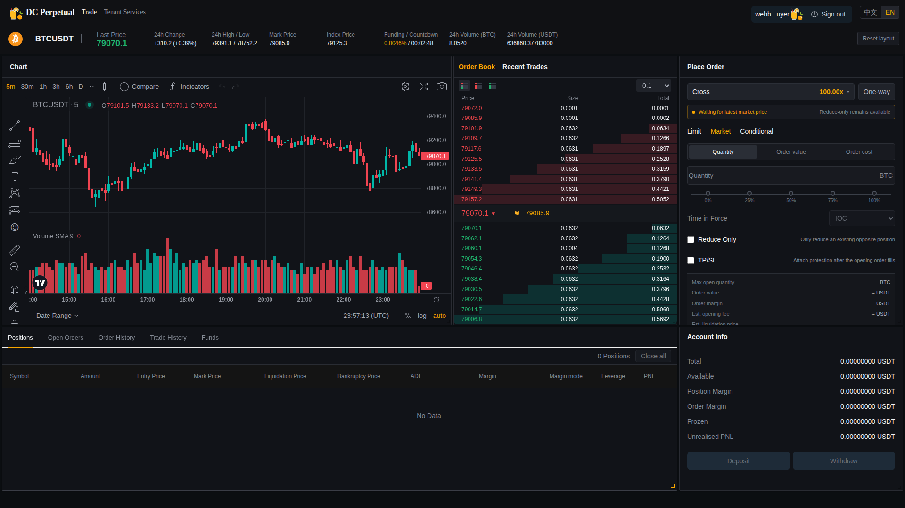
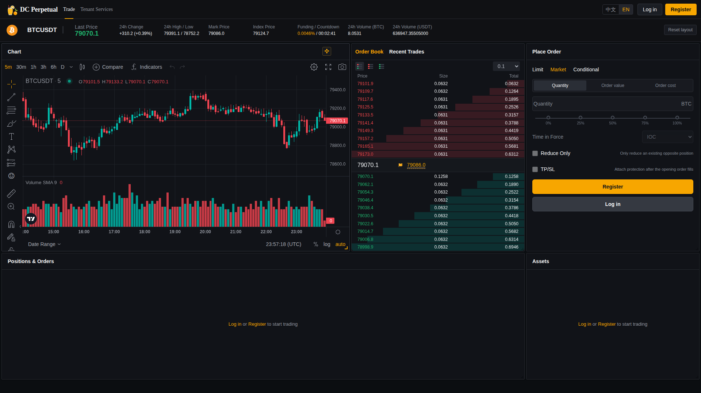
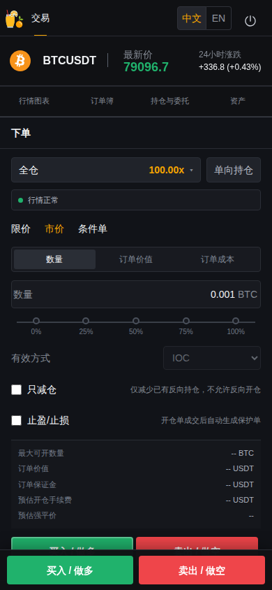

# DC SaaS Web 行情与持仓风险验收（2026-09-08）

## 1. 结论

本批 Web 改造已发布到生产主机 `18.140.45.126`，生产容器 `dc-saas-trade-web` 健康运行。

- 行情连接或订单簿不可用/超过 10 秒未更新时，交易页会明确展示异常状态并禁止开仓。
- 行情异常时仍允许只减仓，避免保护逻辑阻止用户退出风险。
- 行情恢复后开仓按钮自动恢复，无需刷新页面或重新登录。
- 持仓数量下方增加按标记价计算的持仓价值；有效强平价下方增加距强平百分比及分级颜色。
- 无正强平价时仍按产品约定显示 `--`。
- 未修改 OrderSvr、MDSvr、GW 或其他后端服务，仅重新发布 Web 容器。

## 2. 发布版本

| 项目 | 分支 | 版本 |
| --- | --- | --- |
| dc-trade-web | `saas-crypto` | `b648d48b1a8af36fa1983f7ab78ba9b8abee86b1` |
| dc-quant-deploy | `saas-crypto` | 包含本报告与最终 `SOURCE_REV` 固定值的发布提交 |
| 生产 Web 镜像 | `ghcr.io/bliplink/dc-saas-trade-web:saas-crypto` | 待最终镜像发布后记录 |

首次 GitHub Actions `Publish standalone SaaS web image`（run `34171060962`）执行成功；生产截图复核发现安静市场误判后，又发布了上述修正版。

## 3. 行情开仓保护规则

前端按 `location + SecurityID` 分别记录两类实时行情的最近接收时间：

1. MDSvr 订单簿推送；
2. MDSvr 最新成交/标记价格推送。

只有同时满足以下条件才允许提交非只减仓订单：

- GW WebSocket 状态为 `connected`；
- 当前租户、当前品种已收到订单簿；
- 当前租户、当前品种的订单簿距当前时间不超过 10 秒。

最新成交时间仍被记录用于诊断，但不作为开仓门控：在没有成交的安静市场中，最新成交事件不更新是正常现象，不能等同于行情链路中断。按钮状态每秒刷新一次；用户点击下单时会再次读取即时状态，避免按钮渲染和实际点击之间的竞态。该保护属于 Web 端用户体验和误操作防线，不替代后端 OrderSvr 的权威价格保护与风控校验。

## 4. 持仓风险展示规则

- 持仓价值：`abs(持仓数量) × 标记价格`，单位 USDT。
- 多仓强平距离：`(标记价格 - 强平价格) / 标记价格 × 100%`。
- 空仓强平距离：`(强平价格 - 标记价格) / 标记价格 × 100%`。
- 距离 `<= 5%` 显示危险色，`> 5% 且 <= 10%` 显示警告色，其余显示普通辅助色。
- 标记价或强平价无效时不伪造数值；强平价格继续显示 `--`。

## 5. 生产验收结果

| 验收项 | 结果 | 证据摘要 |
| --- | --- | --- |
| 单元测试 | PASS | K 线 4、盘口 3、行情健康 2、持仓风险 3，共 12 项 |
| Webpack 开发构建 | PASS | Webpack 4 完整构建，退出码 0 |
| Web 容器发布 | PASS | `running/healthy`，HTTP 200 |
| 行情断线禁止开仓 | PASS | 重启 Web 代理使现有 WS 断开，观察到异常状态和两个开仓按钮禁用 |
| 行情恢复自动解锁 | PASS | WS 自动重连、token 轮换，行情恢复后两个开仓按钮重新启用 |
| 会话恢复/租户约束 | PASS | 刷新恢复、断线恢复、旧 token 拒绝、跨 location token 拒绝 |
| 登出 | PASS | token 撤销，行情 WebSocket 未替换，登出后公共行情继续更新 |
| 登录态行情 | PASS | 329 根历史 5M K 线、实时 K 线推送、10 档买卖盘口，无 HTTP 行情轮询 |
| 公共态行情 | PASS | 329 根历史 K 线、实时 K 线、10×10 盘口、深度进度条、无需登录 |
| 桌面工作区 | PASS | 5 面板拖拽/缩放/持久化、恢复布局、中英文、图表填满容器 |
| 移动端 | PASS | 390×844 无横向溢出、5 模块页签、固定买卖入口、移动端登出 |

生产证据文件保存在服务器：

- `/data/dc-saas-runtime/e2e-artifacts/web-authenticated-market.png`
- `/data/dc-saas-runtime/e2e-artifacts/web-public-market.png`
- `/data/dc-saas-runtime/e2e-artifacts/web-order-book-depth.png`
- `/data/dc-saas-runtime/e2e-artifacts/workspace-en.png`
- `/data/dc-saas-runtime/e2e-artifacts/workspace-zh.png`
- `/data/dc-saas-runtime/e2e-artifacts/workspace-mobile-en.png`
- `/data/dc-saas-runtime/e2e-artifacts/workspace-mobile-zh.png`
- `/data/dc-saas-runtime/e2e-artifacts/websocket-session-logout.png`

上述 8 张截图已按 SHA-256 校验一致后同步到仓库 `docs/evidence/web-20260908/`。主要证据预览：

## 6. 异常 K 线根因核对

页面曾显示 BTCUSDT 价格从约 79,000 下探到 60,000 的长下影线。生产数据核对结果：

- ClickHouse `dc.kline_view` 的 `WEB_E2E / BTCUSDT / 5M / 2026-09-07 15:50:00` 记录中，最低价确为 `60000`。
- MySQL `dc_orders_execorders` 在 `2026-09-07 15:50:29.981/984` 存在一对真实撮合成交，成交价 `60000`、数量 `0.001`，分别为 Buy maker 与 Sell taker。
- 同一分钟其他成交约在 `79257–79289`。

因此这不是 TradingView、Web 或 MDSvr 的绘图错误，也不应通过过滤真实成交修复。根因属于 OrderSvr 下单/撮合前价格保护缺失或测试委托突破合理价格带。本批遵守并行开发边界，没有修改 OrderSvr；应由 OrderSvr 改造会话补齐权威价格带、偏离度和市价保护后再做专项验收。

## 7. 验收边界

- 本次未提交新订单，未改造或重启 OrderSvr。
- 为恢复自动化验证，仅清理并重建隔离租户 `WEB_E2E` 下 `webbuyer`、`webseller` 两个测试账号的测试订单、持仓和余额；未触碰其他用户或租户。
- 持仓价值和强平距离算法已通过单元测试及生产构建，但隔离 Web 用户在本批验收后无持仓，因此尚未形成“非零持仓页面截图”。待 OrderSvr 并行改造收口后，应在统一核心交易验收中补拍该证据。
